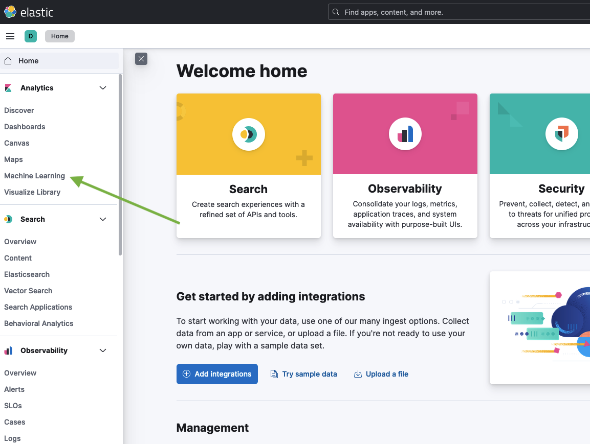
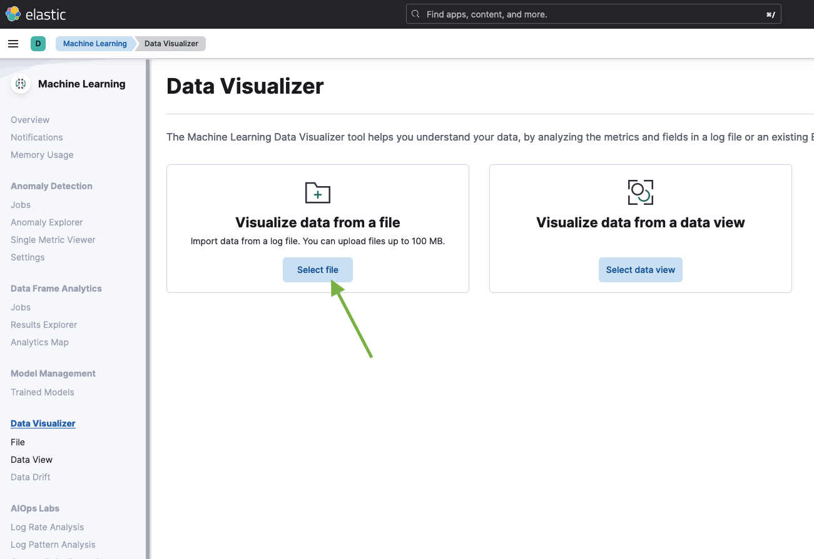
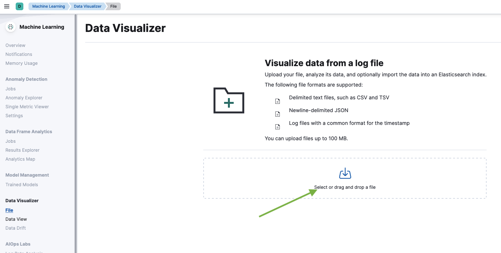
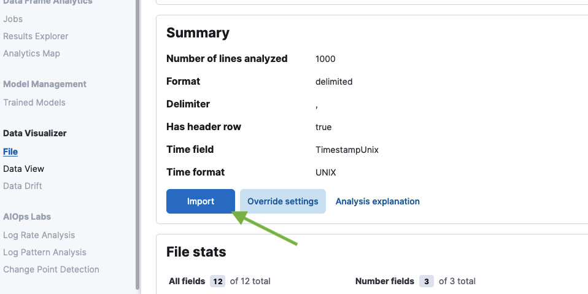
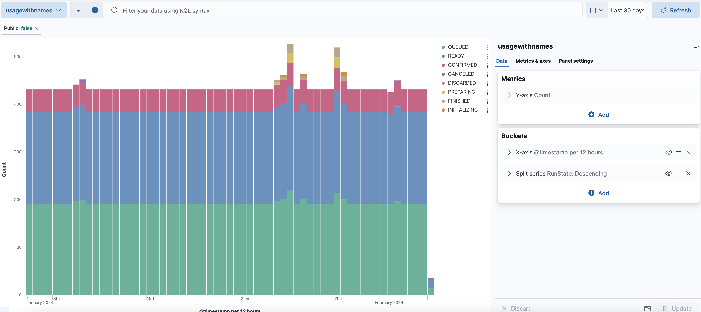

# Usage

## Download Usage Data

Usage data can be downloaded:

- from the Usage page: Organization Settings -> Other -> Usage
- using [spacectl](https://github.com/spacelift-io/spacectl) command: `spacectl profile usage-csv`
- via the Spacelift API at `https://<your-spacelift-host>/usageanalytics/csv` (note: this is not a GraphQL endpoint)

## Analyzing Usage Data

### Load CSV data into PostgreSQL

Create a table for worker count and load the CSV file into the table:

```sql
create table worker_count (
  id int,
  count int,
  timestamp_unix int,
  worker_pool_name varchar(255)
);
```

```shell
psql -h <host> -U <user> -d <database> -c "\copy worker_count from '<path-to-csv-file>' delimiter ',' csv header"
```

And the same for run minutes:

```sql
create table run_minutes (
  timestamp_unix bigint,
  state_duration_minutes float,
  public boolean,
  run_state varchar(255),
  run_type varchar(255),
  run_ulid varchar(26),
  stack_name varchar(255),
  stack_slug varchar(255),
  stack_ulid varchar(26),
  is_stack boolean,
  worker_pool_name varchar(255),
  worker_pool_ulid varchar(26)
);
```

```shell
psql -h <host> -U <user> -d <database> -c "\copy run_minutes from '<path-to-csv-file>' delimiter ',' csv header"
```

### ELK stack

CSV files can be easily imported into [Elastic Stack](https://www.elastic.co/elastic-stack/) for visualization. The following example shows how to import your csv data into [Kibana](https://www.elastic.co/kibana) using [Data Visualizer](https://www.elastic.co/blog/importing-csv-and-log-data-into-elasticsearch-with-file-data-visualizer).

Steps:

1. Download the CSV file.

    ```shell
    spacectl profile usage-csv -aspect run-minutes > usage.csv
    ```

    Note: the exported CSV data doesn't contain zero values, so percentile calculations will be incorrect. To fix this, you can add zero values to the CSV file before processing it.

2. Open Kibana and go to Machine Learning

    

3. Select the CSV file.

    

    

4. Use the mappings that were automatically generated by Kibana.

    

5. Create a visualization using the imported data.

    Here's an example of a visualization that shows the number of run minutes on private workers, broken down by the run state:
    
