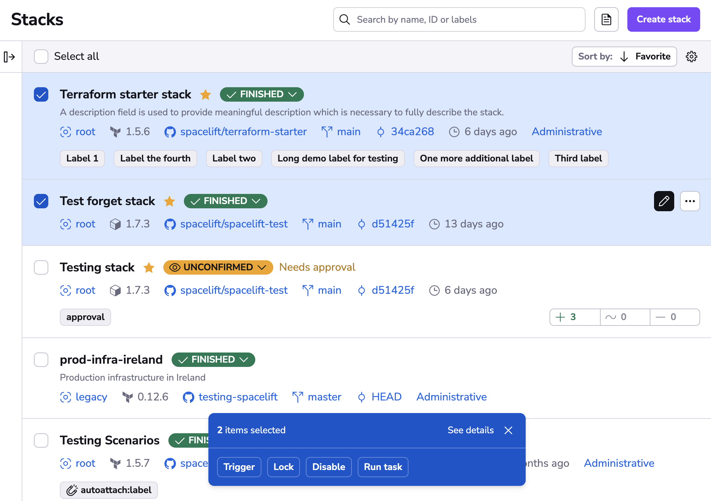
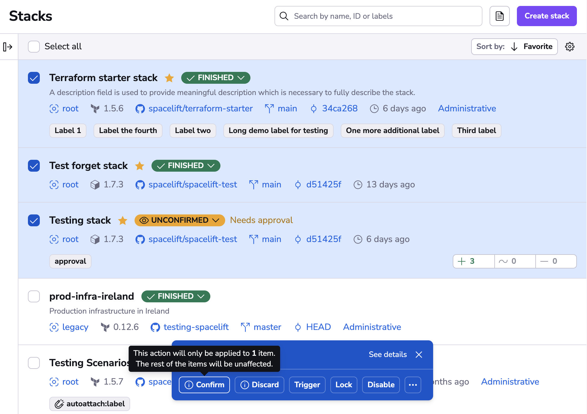
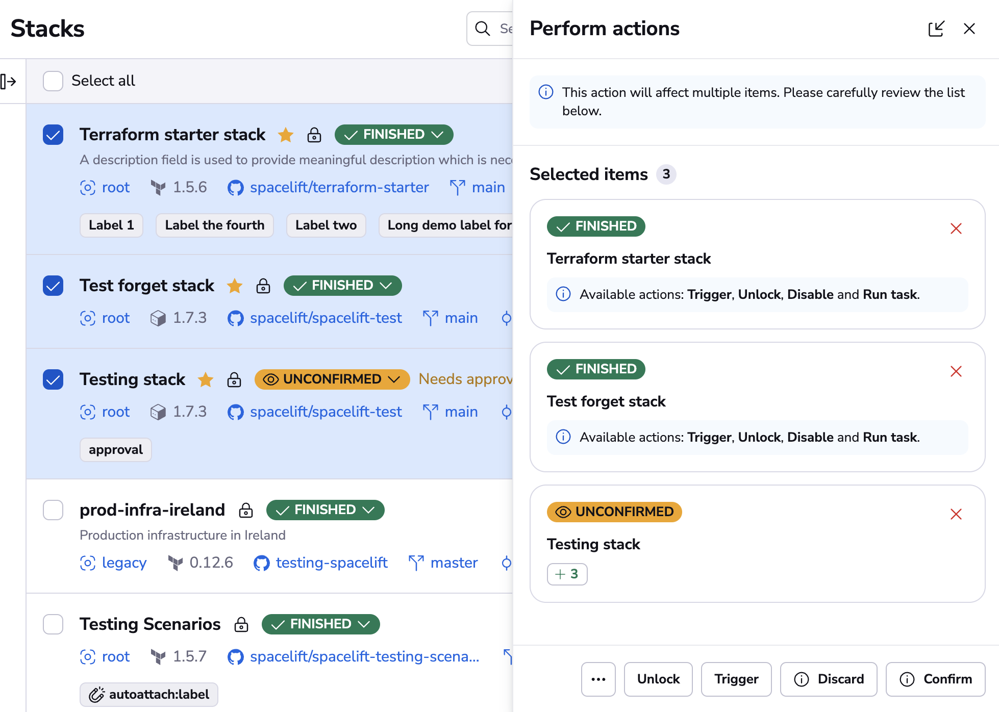
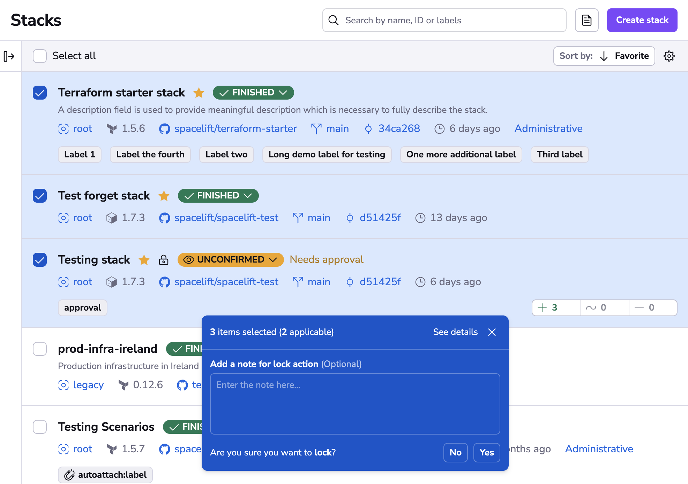
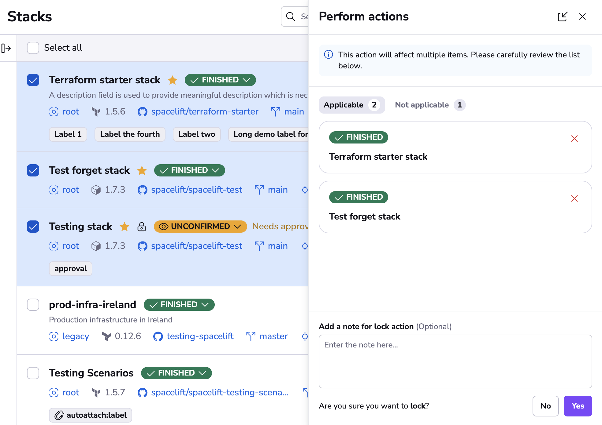
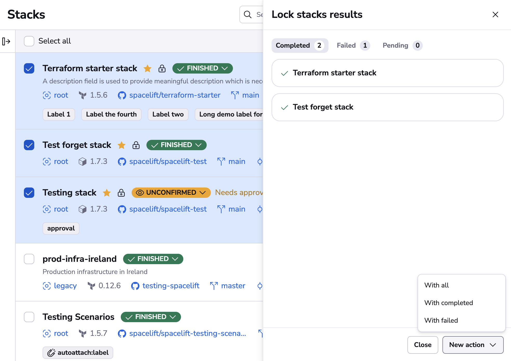
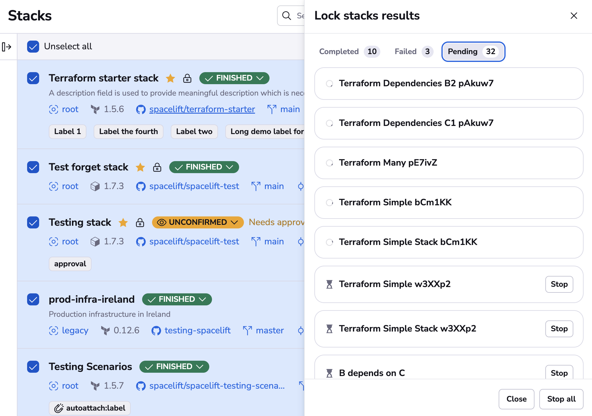

# Bulk actions

Spacelift allows you to perform bulk actions on various entities. This is useful when you need to perform the same action on multiple entities at once. To initiate bulk actions, select the entities you want to perform the action on.

## How to use bulk actions

After you select one or more entities, a floating action bar will appear at the bottom of the screen. This bar will show the number of selected entities and the available actions.

!!! info
    The UI will only show the actions that can be performed on the selected entities, filtering out the unavailable ones for your convenience.

Actions that are not available for all the selected entities will be marked with an icon. You can hover over the icon to see how many entities are going to be affected.

### Performing actions

If you need a more detailed view of the selected entities, click the "See details" button, that will open the bulk actions drawer. From the drawer you can also dismiss any entities you deem unnecessary. Use the floating bar for quick actions and use the drawer when you need to be more careful with your selection.

On the drawer you will see fine-grained details on which actions are available for each of the selected entities.

Once you select an action, you will be presented with a confirmation step that allows you to add additional details (like a note for the Lock action) and to confirm the action itself.

The same view is also available on the drawer, where you can review the applicable and not applicable items again.

Once you confirm the action you'll be presented with the action results drawer, where you can review the status of each item. Please stay on this view until all of your actions are performed, otherwise any in-progress actions will be stopped.

When the bulk execution is complete, you can use the "New action" button to perform another action on the same selection or a subset of it (from the completed or the failed results).

### Stopping actions

Note: It is possible to stop the queued actions if you make a mistake by clicking on either "Stop all" or the "Stop" button available for all queued items.

## Available bulk actions

### Stacks list available actions

When you make the selection on the "Stacks" page you can choose the intended action from the following options:

- Approve - Adds an approval for stacks that require [approval policy](../concepts/policy/approval-policy.md) reviews.
- Confirm - Confirms the blocking run for stacks in the `Unconfirmed` state.
- Disable - Disables the stacks, so they will not trigger any runs.
- Discard - Discards the blocking run for stacks in the `Unconfirmed` state.
- Enable - Enables the stacks.
- Lock - Locks the stacks for exclusive use.
- Reject - Adds a rejection for stacks that require [approval policy](../concepts/policy/approval-policy.md) reviews.
- Run task - [Manually triggers a run](../concepts/run/task.md) with a custom command.
- Sync commit - Updates stacks to point at the latest HEAD commit for their tracked branches.
- Trigger - [Triggers a tracked run](../concepts/run/tracked.md#triggering-manually) for stacks.
- Unlock - Unlocks stacks that are currently locked.

### Stack runs list available actions

When you make the selection on the "Stack runs" page you can choose the intended action from the following options:

- Approve - Adds an approval for runs that require [approval policy](../concepts/policy/approval-policy.md) reviews.
- Confirm - Confirms the runs in the `Unconfirmed` state.
- Discard - Discards the runs in the `Unconfirmed` state.
- Reject - Adds a rejection for runs that require [approval policy](../concepts/policy/approval-policy.md) reviews.

### Runs view available actions

On the "Runs" page all the filtered runs will be available for bulk actions. Once you filter out the items you will see the bulk actions floating bar (if any of the actions are applicable) from the following options:

- Approve - Adds an approval for runs that require [approval policy](../concepts/policy/approval-policy.md) reviews.
- Confirm - Confirms the runs in the `Unconfirmed` state.
- Discard - Discards the runs in the `Unconfirmed` state.
- Reject - Adds a rejection for runs that require [approval policy](../concepts/policy/approval-policy.md) reviews.

### Modules list available actions

When you make the selection on the "Modules" page you can choose the intended action from the following options:

- Disable - Disables the modules, so they will not trigger any runs.
- Enable - Enables the modules.
- Favorite - Marks the modules as favorite, so they appear on top of the list.
- Unfavorite - Unmarks the modules as favorite.

### Notifications available actions

When you make the selection on the "Notifications" page you can choose the intended action from the following options:

- Dismiss - Dismisses the notifications for easier filtering.

### Private worker pool workers list available actions

When you make the selection on the "Private worker pool workers list" page you can choose the intended action from the following options:

- Drain - Disables scheduling future runs on the workers.
- Undrain - Enables scheduling future runs on the workers.

### Worker pools queued runs list available actions

When you make the selection on the "Worker pools queued runs" (public or private) page you can choose the intended action from the following options:

- Deprioritize - Removes the run from the priority queue.
- Discard - Discards the runs in the `Ready` state.
- Prioritize - Moves the run to the priority queue, so it's started before the other runs.

### Run changes view available actions

When you make the selection on the "Run changes" page you can choose the intended action from the following options:

- Replan - Triggers a [targeted replan](../concepts/run/tracked.md#targeted-replan) with the selected changes.
