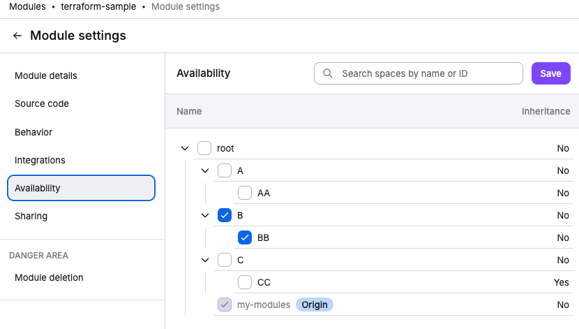

# Changelog

## 2026-02-26

### Features

- **Terragrunt**: Implemented resource destruction when deleting a Terragrunt-managed stack. Previously, deleting a stack only marked it as destroying without performing actual cleanup of Terragrunt-managed resources.

## 2026-02-20

### Features

- **Terragrunt**: Added a new _Skip replan_ option for stacks using Run All mode. When enabled, the second planning phase during the apply stage is skipped by reusing the saved plan, which can speed up deployments.

## 2026-02-18

### Features

- **Templates**: Introduced a self-service infrastructure provisioning system that enables application developers to deploy infrastructure without deep IaC or Spacelift knowledge. Templates provide a form-based deployment interface with reusable, versioned configurations that maintain lifecycle control over deployed infrastructure.

    Unlike Blueprints which create independent stacks that live separately after creation, Templates maintain ongoing lifecycle management of deployed stacks. Changes to template-managed stacks must be made through the template system (updating deployment inputs, switching versions, or publishing new template versions), providing governance and consistency while still allowing controlled infrastructure evolution.

    See the [Templates documentation](../concepts/template/README.md) for more details.

## 2026-02-04

- **Terragrunt Stacks**: OpenTofu is now the default tool when creating Terragrunt stacks, replacing Terraform as the default option.

## 2026-02-02

- UI feature: Added warning when attaching stack roles to admin stacks.

## 2026-01-30

- API fix: Resolved URL handling for OIDC keys with double slashes in audience.

## 2026-01-28

### Features

- **Drift Detection Permissions**: Added granular RBAC permissions for drift detection management. Users can now be granted specific permissions to create, update, or delete drift detection schedules on stacks (`DRIFT_DETECTION_INTEGRATION_CREATE`, `DRIFT_DETECTION_INTEGRATION_UPDATE`, `DRIFT_DETECTION_INTEGRATION_DELETE`), enabling more fine-grained access control for drift detection operations.

## 2026-01-21

### Features

- **AWS Integration**: Added session tagging support for AWS role assumptions. You can now enable the "Enable tag session" option when creating or editing AWS integrations, which adds session tags when Spacelift assumes the configured IAM role. This helps with AWS CloudTrail auditing and compliance tracking. When enabled, the trust policy must include the `sts:TagSession` permission.

## 2026-01-13

- fix(dashboard): exclude modules from Stacks state dashboard element
- feat(oidc-federation): add use:sig field to .well-known/jwks endpoint

## 2026-01-09

- **Advanced Access Control**: Added granular permissions for Terraform Module Registry management. You can now control how module can be
    shared with other spaces. This allow to share a module with a space without granting full write to the target space.
    - `SPACE_SHARE_MODULE` - Allow modules to be shared with an assigned space from other spaces

    You may also probably want to set the `SPACE_READ` permission in order for your users to be able to see the availaible spaces in the UI.

    See the [module sharing documentation](../vendors/terraform/module-registry.md#sharing-modules) for more details.

## 2025-12-17

### Features

- **Cloud Integrations**: AWS and Azure integrations now support auto-attachment to stacks and modules. This follows the same behavior as other auto-attachable resources like contexts and policies. See the cloud integration documentation for [AWS](../integrations/cloud-providers/aws.md#auto-attach-integrations) and [Azure](../integrations/cloud-providers/azure.md#auto-attach-integrations) for more details.

## 2025-12-10

### Features

- **Advanced Access Control**: Added granular permissions for Terraform Module Registry management. You can now control who can disable/enable modules, trigger module version tests, and mark module versions as bad through the following new permissions:
    - `MODULE_DISABLE` - Disable a module
    - `MODULE_ENABLE` - Enable a disabled module
    - `MODULE_TRIGGER_VERSION` - Trigger module version tests
    - `MODULE_MARK_AS_BAD` - Mark a module version as bad (yanking)

  These permissions can be assigned to custom roles in your space, providing fine-grained control over module management operations.

## 2025-11-25

### Fixes

- **Modules**: Fixed an issue where legacy space modules were incorrectly displayed as having no read access when users had valid read permissions. That could have happened if still using legacy space and access policies.

## 2025-11-17

### Features

- **Authorization & RBAC**: Non-root Space Admins can now view all roles, users, API keys, and IdP group mappings (read-only) and manage role bindings within their administered spaces. Previously, these capabilities were limited to Root Space Admins only. See the [RBAC system documentation](../concepts/authorization/rbac-system.md#space-admin) for details.

## 2025-11-13

### Features

- **Login Policy**: Enriched the roles input in login policy data with `slug` and `ulid` fields for better role identification and assignment. See the [login policy documentation](../concepts/policy/login-policy.md#roles) for details.
- **Plugins**: Introduced a new plugin system that allows you to extend Spacelift's functionality with custom integrations and automations. Plugins are written using the [spaceforge](https://github.com/spacelift-io/plugins){: rel="nofollow"} Python SDK and can integrate with third-party services, automate workflows, and enhance your infrastructure management capabilities.

Key features include:

- **Marketplace**: Browse and install plugins from the Templates section in the Spacelift UI
- **Auto-attachment**: Automatically attach plugins to stacks using labels
- **First-class citizens**: Plugins are managed directly in Spacelift, not through stacks
- **Configurable parameters**: Define and configure plugin-specific settings during installation
- **Multiple execution phases**: Run plugins at different stages of your infrastructure lifecycle(before_init, after_plan, after_apply, etc.)

Available plugins include:

- **Infracost**: Estimate infrastructure costs before deployment
- **SOPS**: Secure secret management with encryption/decryption
- **Wiz**: Cloud security scanning and compliance reporting
- **Checkov**: Infrastructure-as-Code security and compliance scanning
- **Terrascan**: Detect security vulnerabilities and compliance violations
- **Trivy**: Comprehensive vulnerability and misconfiguration scanner
- **TruffleHog**: Secret detection and prevention
- **Environment Manager**: Manage environment variables across stacks
- **Envsubst**: Environment variable substitution in configuration files
- **OpenTofu Tracing**: Enhanced tracing and debugging for OpenTofu runs

Plugins automatically create and manage related Spacelift resources (contexts, policies, webhooks) which are locked in the UI and managed through the plugin interface.

See the [plugins documentation](../integrations/plugins.md) for installation guides, usage instructions, and plugin development guidelines.

## 2025-11-12

### Features

- **Kubernetes Worker Pools**: The Kubernetes worker pool controller now supports auto-registration with version `v0.0.27`.

  Worker pools can be created and managed entirely through Kubernetes resources without manual setup in the Spacelift UI.
  The controller automatically registers pools with Spacelift, generates credentials, and handles the complete lifecycle.

  This enables pure GitOps workflows where worker pools are provisioned declaratively alongside other infrastructure.

  Additionally, OIDC-based API keys can be used to eliminate static credentials from the cluster entirely.

  See the [auto-registration documentation](../concepts/worker-pools/kubernetes-workers.md#auto-registration) for more details.

## 2025-11-10

### Features

- **Authorization & RBAC**: Stacks can now assume roles for elevated permissions through stack role attachments, replacing the legacy administrative flag. This new approach provides three key advantages:
    - **Cross-space access**: Attach roles for sibling spaces, not just the stack's own space and subspaces
    - **Fine-grained permissions**: Use [custom roles with specific actions](../concepts/authorization/rbac-system.md#custom-roles) instead of full Space Admin permissions
    - **Enhanced audit trail**: Role information (`actor_roles`) is included in [webhook payloads](../integrations/audit-trail.md#usage) for better visibility

The administrative flag is deprecated for stacks and [will be automatically disabled](../concepts/authorization/assigning-roles-stacks.md#migration-from-administrative-flag) on **June 1st, 2026**. On that date, Spacelift will backfill affected stacks with Space Admin roles (100% backward compatible), but manual migration is recommended to access advanced features and to avoid drifts in the OpenTofu/Terraform state.

!!! note
    [Modules](../vendors/terraform/module-registry.md) are not affected by this change. The administrative flag for modules remains unchanged.

See the [stack role bindings documentation](../concepts/authorization/assigning-roles-stacks.md) for migration guides and detailed examples.

## 2025-11-07

### Features

- **Rego Version Selector**: Added support for switching between Rego v0 and v1 when editing policies. A version selector is now available in the policy editor, allowing you to easily switch between versions. We recommend using Rego v1 for all new policies. See the [policy documentation](../concepts/policy/README.md#rego-version-support) for more information.

## 2025-10-27

### Features

- **Account default runner images** — Added support for account default runner images. See the [runtime security](../integrations/docker.md#account-default-runner-images) for more information.
- **Account Deletion**: Improved account deletion user experience with a dedicated settings tab, confirmation modals, and a safer two-step deletion process. Account deletion has been moved from the header dropdown to a dedicated tab in organization settings, with a 7-day waiting period after marking for deletion and multiple confirmation steps to prevent accidental deletions. Additionally, we now collect feedback about deletion reasons to help improve the product.

## 2025-10-17

### Features

- **Dashboard**: The Dashboard is now accessible to all users, not just admins. Non-admin users can view most dashboard widgets, with the Launch Pad and User Activity widgets remaining admin-only.
- **Integrations**: Migrated the slack integration management screen to the integrations page. The legacy UI has been removed, and all the legacy URLs now redirect to the new screen in the Integrations page.

- **Module Registry**: Modules can now be shared with specific spaces within your account, providing fine-grained control over which teams can discover and use your modules.

    

    The module list includes an availability filter to help you find modules shared with your spaces.

    Space-level sharing is now the recommended approach for most organizations, with cross-account sharing remaining available for backwards compatibility.

    See the [module sharing documentation](../vendors/terraform/module-registry.md#sharing-modules) for more details.

## 2025-10-15

### Features

- **Filters**: Enhanced filtering interface with improved selection states, dropdown functionality, and visual styling for better user experience
- Added SSO SAML attribute mapping support. See the [custom attribute mapping documentation](../integrations/single-sign-on/README.md#custom-attribute-mapping) for more information.

## 2025-10-14

### Features

- **Personal Settings**: You can now find new "Spaces" view under your personal settings. This view lets you see the permissions you have for each space, making it easier to understand your access across Spacelift.

## 2025-10-10

### Features

- **VCS Integrations**: Completed migration to the new VCS integration interface. The legacy VCS integration UI has been removed, and the source code integrations can now be accessed using the new integrations screen.

## 2025-10-03

## Features

- You can now create API keys via the TF provider. See the [API keys resource documentation](https://search.opentofu.org/provider/spacelift-io/spacelift/latest/docs/resources/api_key) for more information.
- Added SSO OIDC claim mapping support. See the [custom claims mapping documentation](../integrations/cloud-providers/oidc/README.md#configuring-custom-claims-mapping) for more information.

## 2025-10-01

### Features

- Run log retention period can now be configured at the organization level. This allows you to set how long run logs are retained before being automatically deleted. More details can be found in the [run log retention documentation](../concepts/run/README.md#logs-retention).

## 2025-09-30

### Features

- Detailed policy schema can now be retrieved from a public URL served by the Spacelift API. Each policy type has a detailed JSON schema definition which can be used for validation or provided to LLMs to generate policies. The schema can be found at [.well-known/policy-contract.json](https://app.spacelift.io/.well-known/policy-contract.json).

## 2025-09-16

### Features

- Run details now display both the API key ID and name when triggered by an API key. Previously only the key ID was shown, which made it difficult to identify which key was used. The key ID is shown in shortened format. For example: `api::01K56PK::DevopsSpaceKey`.
