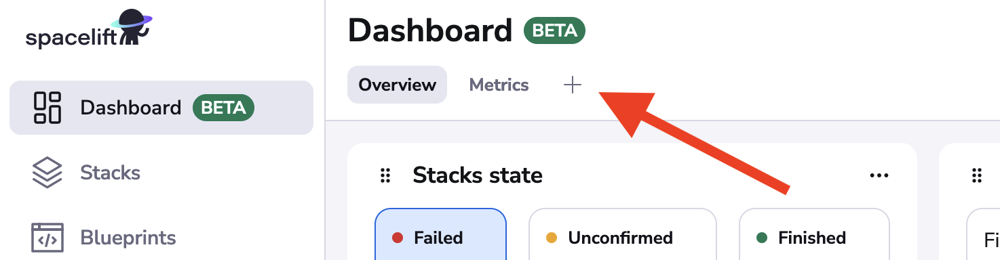
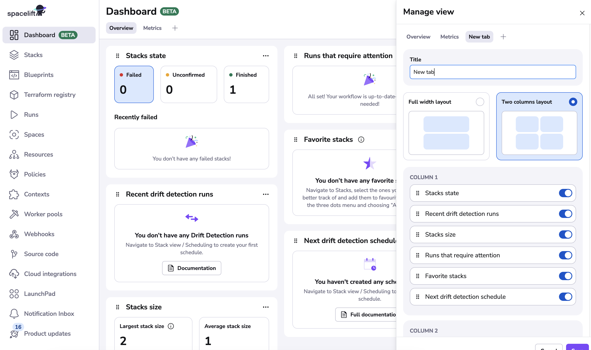
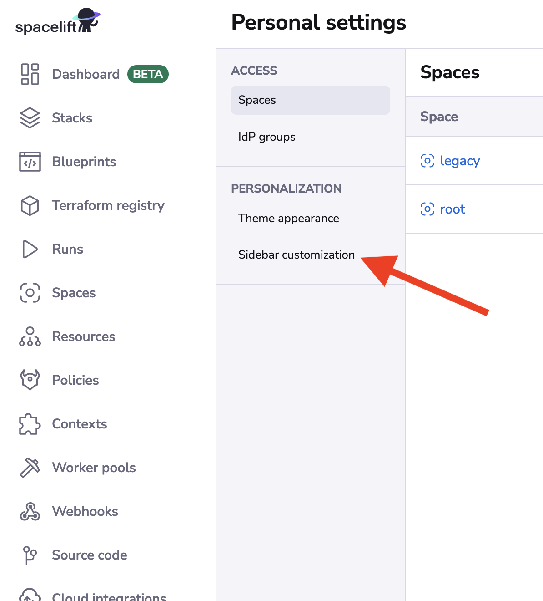
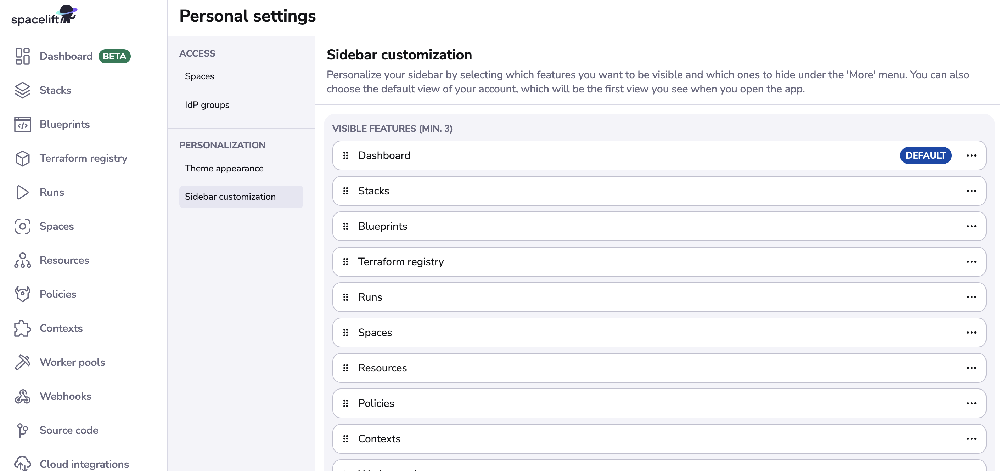

# Dashboard

!!! info
    Non-admin users can view most dashboard widgets, with the Launch Pad and User Activity widgets remaining admin-only. The user can see only those entities that belong to spaces he has access to.

The dashboard is the first page you see when logging into the app. It provides an overview of your account and the
status of your infrastructure.

## Creating a new view

The Dashboard comes with two predefined views: `Overview` and `Metrics`. You can switch between them by clicking on the
tabs at the top of the page.

You can also create your own views to customize the dashboard to your needs. To create a new view, click on the `+`
button next to the existing tabs.

The "Manage views" dialog will appear. Here you can customize the layout settings and choose the widgets you want to display.

## Changing the landing page

The landing page of the app is the first page you see when you log in. By default, it is set to the dashboard. However,
you can change it to a different page in your "Personal settings".

To change the landing page, click on your profile picture in the bottom left corner of the app and select "Personal
settings". Next, go to the "Sidebar customization" in the "Personalization" section.

By setting your selected page to be the default, you will be redirected to it every time you log in to the app. To
select a page to be the default, click on the three dots next to the page name and select "Set as default".

