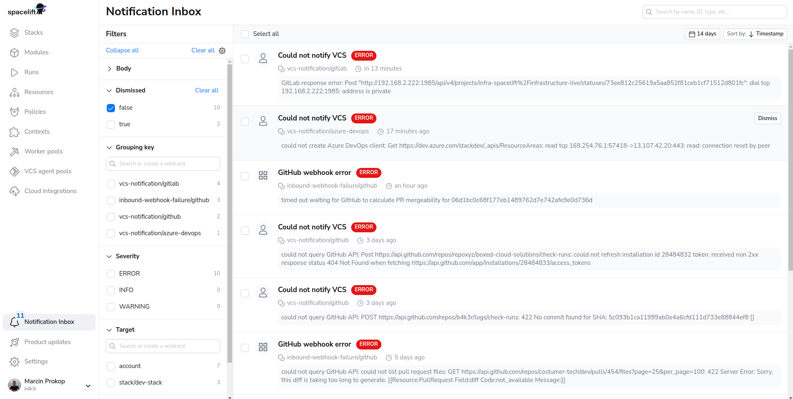
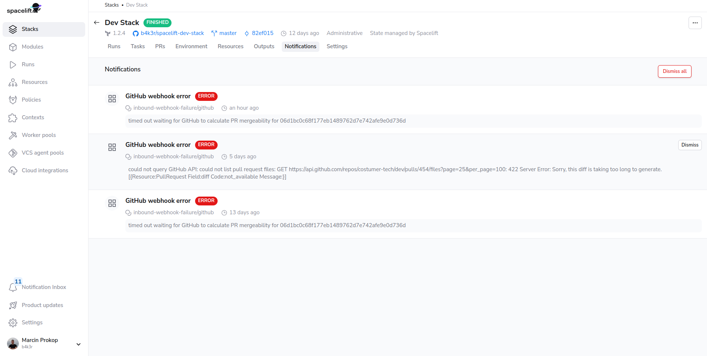

# Notifications


!!! hint
    This feature is only available to paid Spacelift accounts. Please check out our [pricing page](https://spacelift.io/pricing){: rel="nofollow"} for more information.


As nicely stated by [Murphy's law](https://en.wikipedia.org/wiki/Murphy%27s_law){: rel="nofollow"}: "Anything that can go wrong will go wrong.". Some issues will blow in your face and be obvious, and others will be sneakier.

In the background, Spacelift interacts with different systems (VCS providers, cloud providers, Slack, etc.), which can fail in various ways. The Notification Inbox section gives you visibility into issues arising from those interactions.

## Visibility

Notifications are only available to admins.

They can be checked either at the account level, which includes all the stacks.

Or, they can be checked for a specific stack.

## Available Categories

Currently, the Notifications only include VCS provider issues, but more categories will be added soon.

## Retention

Notifications are kept for 14 days.
