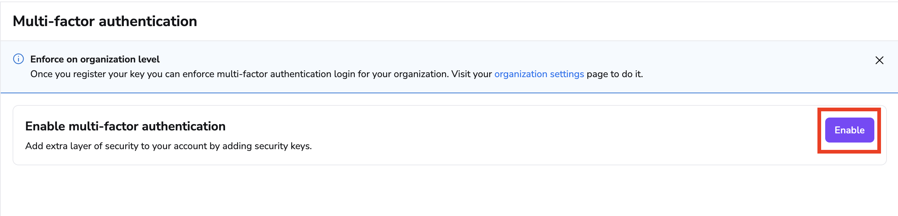
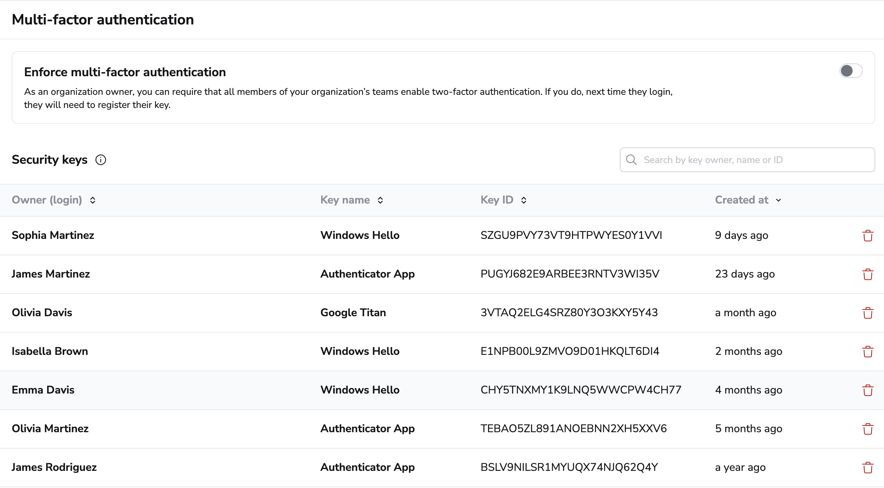

# Multi-Factor Authentication (MFA)

With the introduction of IdP independent Multi-Factor Authentication (MFA), we extend our security capabilities to provide a robust and flexible authentication system. MFA at Spacelift is designed to protect your account and sensitive resources by requiring a second form of verification, adding a critical layer of security against unauthorized access.

!!! warning
    Before enabling MFA, consider to set backup credentials. This ensures that you can still access your account in the event of a lost security key or other unforeseen issues. You can find more about this in the [Backup Credentials](../../integrations/single-sign-on/backup-credentials.md) section.

## Setting Up MFA for Your Account

### Enable MFA

Go to the _Personal settings_. Next, navigate to _Multi-factor authentication_. Here, you can add personal security keys that will be used for authentication.

### Adding Security Keys

- Click on the _Enable_ button to activate MFA.

- Follow the prompt to register your security key; you can name it for easy identification.
- Once added, the key will appear in your list of security keys, complete with details like the key name, key ID, and creation date.

### Deleting Security Keys

You can remove a security key at any time. To delete, click the trash icon next to the key you wish to remove and confirm your action.

## Setting Up MFA for Organization

In order to manage MFA in your organization, please go to the _Organization settings_. Next, navigate to _Multi-factor authentication_.

Admins can view and delete security keys for any user within the organization to maintain the organization's security integrity.

### Enforce MFA

Organization admins can enforce MFA across the organization to ensure that all users comply with the security standards. Enforcing MFA means every active user must have at least one registered security key.

!!! warning
    After MFA enforcement, existing sessions except for the current one will be invalidated. Users will be prompted to register their security keys during their next login session for continued access, please make sure they have FIDO2 complinant device to avoid lockout.

### After Enforcing MFA

Once MFA is enforced, all users must maintain at least one security key. The option to disable MFA (or delete all security keys) is disabled in _Personal settings_ for them. However, Admin always has the right to delete the user's key in the _Organization settings_.
