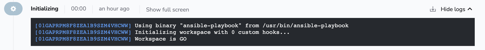
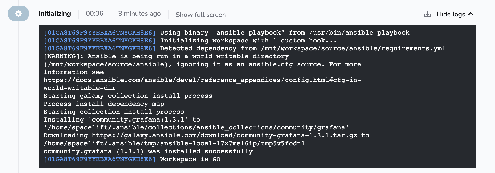

# Ansible Galaxy

If you followed previous examples in our Ansible documentation, you might have noticed that we do not do much in the Initialization phase.



If it comes to Ansible stacks, during that phase we try to auto-detect the _requirements.yml_ file that will be used to install dependencies. We will look for it in the following locations:

- `requirements.yml` in the root directory
- `roles/requirements.yml` for roles requirements
- `collections/requirements.yml` for collections requirements

As an example, try using an example `requirements.yml` file.

```yaml title="Example requirements.yml file"
---
collections:
  - name: community.grafana
    version: 1.3.1
```

After our Initialization phase detects this file, it will use [Ansible Galaxy](https://galaxy.ansible.com){: rel="nofollow"} to install those dependencies.


