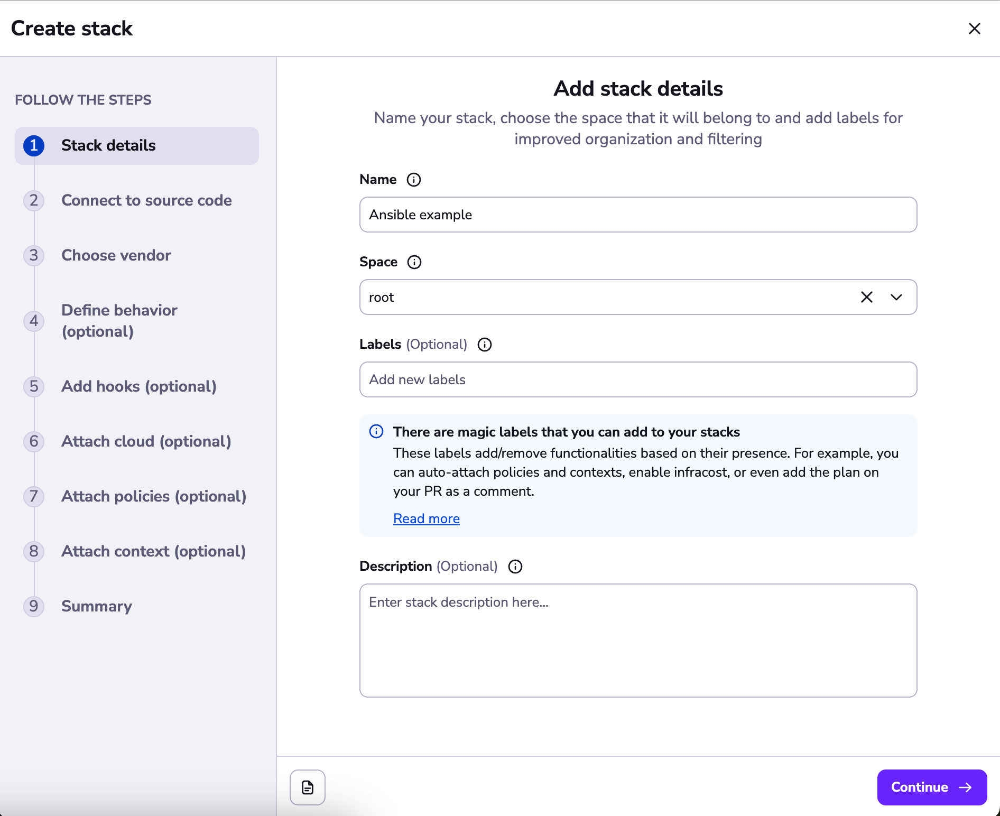
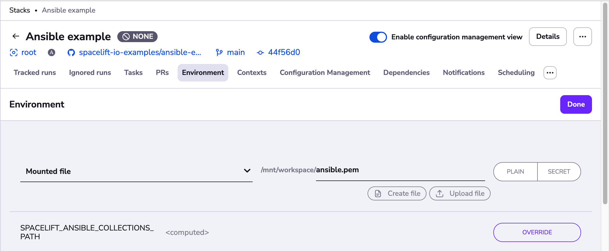
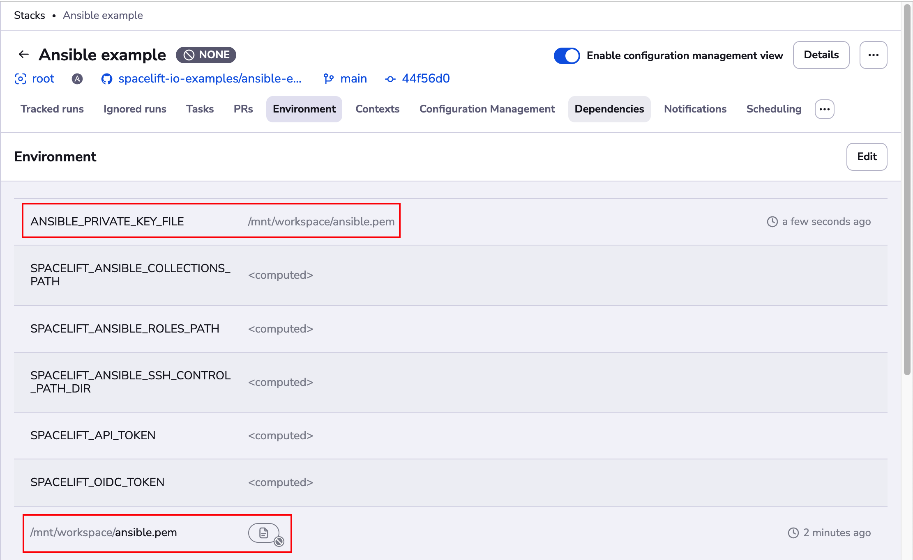

# Getting Started

## Prerequisites

To follow this tutorial, you should have an EC2 instance together with an SSH private key that can be used to access the instance ready.

## Initial Setup

Start by forking our [Ansible example repository](https://github.com/spacelift-io-examples/ansible-example){: rel="nofollow"}

Looking at the code, you'll find that it configures a simple Apache HTTP Server on an EC2 instance. We are also using the [AWS EC2 inventory plugin](https://docs.ansible.com/ansible/latest/collections/amazon/aws/aws_ec2_inventory.html){: rel="nofollow"} to find the hosts to configure. Feel free to modify [`aws_ec2.yml` inventory file](https://github.com/spacelift-io-examples/ansible-example/blob/main/aws_ec2.yml){: rel="nofollow"} to fit your needs.

Also, please take notice of the [Spacelift runtime config file](https://github.com/spacelift-io-examples/ansible-example/blob/main/.spacelift/config.yml){: rel="nofollow"}, that defines the runner image used on this stack and the [`ANSIBLE_CONFIG`](../ansible/reference.md#ansiblecfg) environment variable. Remember you can always define runner image in [stack settings](../../concepts/stack/stack-settings.md#runner-image), and environment variables within [environment settings](../../concepts/configuration/environment.md#environment-variables).

## Creating a stack

In Spacelift, go ahead and click the **Add Stack** button to create a Stack in Spacelift.

In the first step of the stack creation wizard, choose a name for your stack:

In the next step, choose the repository that you have just cloned:

Next, choose the Ansible vendor, and enter the name of the playbook you want to execute. In the case of our example, it is _playbook.yml_.

Next, continue to the _define behavior_ section, and enter a runner image to use. This should point at a container image that contains the version of Ansible you require. You may use your own image (with the Ansible version you choose and all the required dependencies) or use one of our [default ones](https://github.com/spacelift-io/runner-ansible){: rel="nofollow"}. In this example we are using an AWS-based runner image defined in the [runtime configuration file](#initial-setup): `public.ecr.aws/spacelift/runner-ansible-aws:latest`.

If you have a private worker pool you'd like to use, you can specify it there instead of the default public one as well.

At this stage, you can go ahead and continue to the end of the stack creation wizard and create your stack:

## Triggering the Stack

### Making sure the inventory plugin works

You can now click Trigger to create a new Spacelift Run.

You should see the run finishing with no hosts matched. This is because the AWS EC2 inventory plugin did not detect valid AWS credentials.

!!! info
    **You need to configure the AWS integration to give Spacelift access to your AWS account.** You can find the details [here](../../integrations/cloud-providers/aws.md).

### Configuring SSH keys

After triggering a run again, you will see we could successfully find EC2 hosts (provided they could be localized with _aws_ec2.yml_ inventory file filters), but we cannot connect to them using SSH. The reason for that is we did not configure SSH keys yet.

Let's configure the correct credentials using the [Environment](../../concepts/configuration/environment.md).

Go to the Environment tab and add the private key that can be used to access the machine as a secret mounted file.

You should also specify the location of the SSH private key for Ansible, and you can do that using the [`ANSIBLE_PRIVATE_KEY_FILE`](./reference.md#ssh-private-key-location) environment variable.

### Investigating planned changes

Triggering a run again, you should successfully see it get through the planning phase and end up in the unconfirmed state.

In the plan, you can see detailed information about each resource that is supposed to be created.

At this point, you can investigate the changes Ansible playbook will apply and to which hosts.

When you're happy with the planned changes, click **Confirm** to apply them.

By now, the machine should be configured with a simple Apache HTTP server with a sample website on port 8000.

You can switch to the **Resources** tab to see the hosts you have configured, together with the history of when the host was last created and updated.

## Conclusion

That's it! You can find more details about the available configuration settings in the [reference](reference.md). Apart from configuration options available within Spacelift remember you can configure Ansible however you'd like using native Ansible configuration capabilities.
