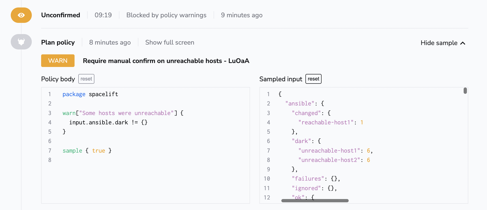

# Spacelift Policies with Ansible

## Plan Policy with Ansible

Using our native [Plan Policy](../../concepts/policy/terraform-plan-policy.md) you could implement advanced handling of different situations that can happen while running playbooks on multiple hosts.

One good example is if you'd like to manually review situations when some of the hosts were unreachable, but still be able to apply the change regardless.

You could test it using the following Plan Policy:

```opa
package spacelift

warn["Some hosts were unreachable"] {
  input.ansible.dark != {}
}

sample { true }
```

Once you attach the above Plan Policy to an Ansible stack that is configured in a way not to fail when finding unreachable hosts, you could automatically detect unreachable hosts using a Plan Policy and require approval using the [Approval Policy](../../concepts/policy/approval-policy.md).

Please find an example policy evaluation below:


## Linking OpenTofu/Terraform and Ansible workflows

You can use our [Trigger Policy](../../concepts/policy/trigger-policy.md) to link multiple stacks together. This applies also to stacks from different vendors.

One of the [use cases](https://spacelift.io/blog/spacelift-ansible-integration-beta){: rel="nofollow"} is to link OpenTofu/Terraform and Ansible workflows so that you could use Ansible to configure EC2 instances you've just created using OpenTofu/Terraform.

We provide an extensive example of one way to set something like this up in our [Terraform-Ansible workflow demo repository](https://github.com/spacelift-io-examples/terraform-ansible-workflow-demo){: rel="nofollow"}.
