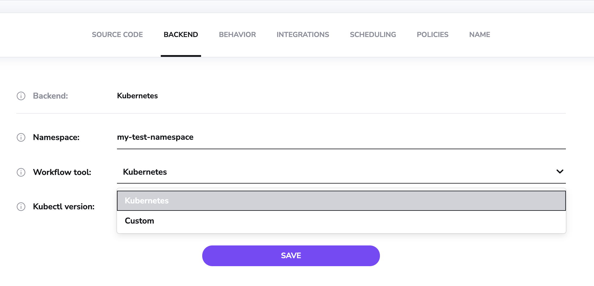
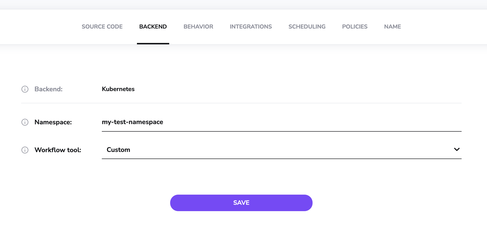
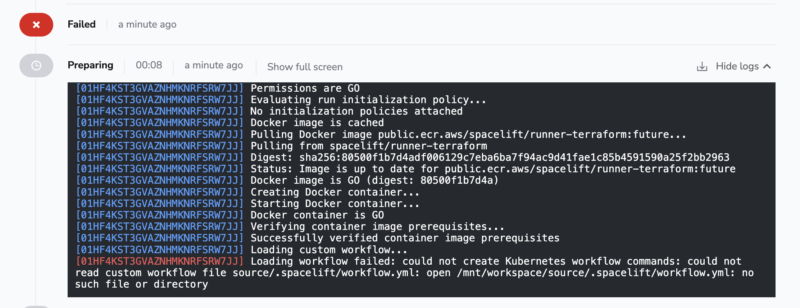
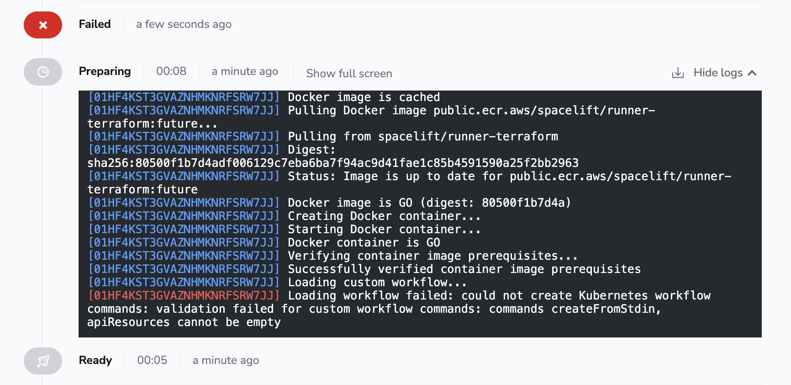
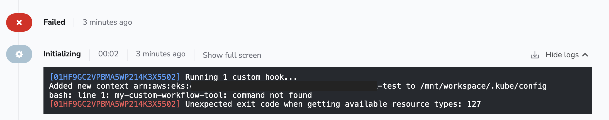

# Workflow Tool

The Workflow Tool stack setting allows you to choose between two options:

- Kubenetes.
- Custom.

The Kubernetes option gives you out of the box support where all you need to do is choose the version you want to use and you're good to go.

The rest of this page explains the Custom option. This option allows you to customize the commands that are executed as part of Spacelift's Kubernetes workflow. This can be useful if you want to run a custom binary instead of one of the kubectl versions supported by our Kubernetes integration out the box.

!!! info
    Note that any custom binary is considered third-party software and you need to make sure you have the necessary rights (e.g. license) to use it.

## How does it work?

Each stage of the Kubernetes workflow uses certain commands to perform tasks such as listing API resources availible at the server or applying the resources. We provide a built-in set of commands to use for Kubernetes, but you can also specify your own custom commands. You do this via a file called `.spacelift/workflow.yml`.

The following is an example of what the workflow commands look like for Kubernetes:



```yaml

# Used to create a resource from standard input. We use this
# query to make authorization SelfSubjectAccessReview request.
createFromStdin: "kubectl create -f - -o yaml"


# Used to list api resources supported on the server.
#
# Available template parameters:
# - .NoHeaders    - controls the --no-headers argument of kubectl.
# - .IsNamespaced - controls arguments to provide if we use a namespace.
# - .OutputFormat - output format of a reequest, can be set to two values: name or wide.
apiResources: "kubectl api-resources {{ if .NoHeaders }}--no-headers {{ end }}--verbs=list,create {{ if .IsNamespaced }}--namespaced {{ end }}-o {{ .OutputFormat }}"

# Used to both plan and apply changes.
#
# Available template parameters:
# - .PruneWhiteList - provides list of arguments to the --prune flag.
# - .StackSlug      - the slug of a current stack.
# - .DryRunStrategy - dry run sttrategy, can be set to values: none, client, server.
# - .OutputFormat   - output format. Can be set to empty value or json.
# - .Namespace      - the namespace used.
apply: "kubectl apply -k ./ --prune {{ .PruneWhiteList }} -l \"spacelift-stack={{ .StackSlug }}\" --dry-run={{ .DryRunStrategy }}{{ if .OutputFormat }} -o {{ .OutputFormat }}{{ end }}{{ if .Namespace }} --namespace={{ .Namespace }}{{ end}}"

# Rollout status command used to check the rollout status of resources.
#
# Available template parameters:
# - .Namespace                - the namespace used.
# - .RolloutTimeoutInSeconds  - a timeout in seconds that will be passed to the command.
# - .Id                       - id of the resource to watch.
rolloutStatus: "kubectl rollout status{{ if .Namespace }} --namespace={{ .Namespace }}{{ end}} --timeout {{ .RolloutTimeoutInSeconds }}s -w {{ .Id }}"

# List a pods based on selector passed. We use getPods command
# to display status of pods while they are being deployed.
#
# Available template parameters:
# - .Namespace - the namespace used.
# - .Pods      - a selector passed to get pods command.
getPods: "kubectl get pods{{ if .Namespace }} --namespace={{ .Namespace }}{{ else }} --all-namespaces{{ end}} -w -l '{{ .Pods }}'"

# Used to tear down any resources as part of deleting a stack.
#
# Available template parameters:
# - .StackSlug          - the slug of a current stack.
# - .Namespace          - the namespace used.
# - .ResourcesToDelete  - list of resources to delete.
delete: "kubectl delete --ignore-not-found -l spacelift-stack={{ .StackSlug }}{{ if .Namespace }} --namespace={{ .Namespace }}{{ else }} --all-namespaces{{ end}} {{ .ResourcesToDelete }}"

# APPLE
#
# Available template parameters:
# - .StackSlug            - the slug of a current stack.
# - .Namespace            - the namespace used.
# - .ResourceKindsToGet   - list of kinds of resources to get.
get: "kubectl get -o json --show-kind --ignore-not-found -l spacelift-stack={{ .StackSlug }}{{ if .Namespace }} --namespace={{ .Namespace }}{{ else }} --all-namespaces{{ end}} {{ .ResourceKindsToGet }}"
```



## How to configure a custom tool

To use a custom tool, three things are required:

1. A way of providing the tool to your runs.
2. A way of specifying the commands that should be executed.
3. Indicating that you want to use a custom tool on your stack/module.

### Providing a tool

There are two main ways of providing a custom tool:

- Using a [custom runner image](../../integrations/docker.md#customizing-the-runner-image).
- Using a [before_init hook](../../concepts/stack/stack-settings.md#customizing-workflow) to download your custom tool.

### Specifying the commands

Your custom workflow commands need to be provided in a `workflow.yml` file stored in the `.spacelift` folder at the root of your workspace. There are three main ways of providing this:

1. Via a mounted file in the stack's environment.
2. Via a mounted file stored in a [context](../../concepts/configuration/context.md)
3. Directly via your Git repo.

The option you choose will depend on your exact use-case, for example using the stack's environment allows you to quickly test out a new custom tool, using a context allows you to easily share the same configuration across multiple stacks, and storing the configuration in your Git repo allows you to track your settings along with the rest of your code.

Here is an example configuration to use a fictional tool called `my-custom-tool`:



```yaml
createFromStdin: "my-custom-tool create -f - -o yaml"
apiResources: "my-custom-tool api-resources {{ if .NoHeaders }}--no-headers {{ end }}--verbs=list,create {{ if .IsNamespaced }}--namespaced {{ end }}-o {{ .OutputFormat }}"
apply: "my-custom-tool apply -k ./ --prune {{ .PruneWhiteList }} -l \"spacelift-stack={{ .StackSlug }}\" --dry-run={{ .DryRunStrategy }}{{ if .OutputFormat }} -o {{ .OutputFormat }}{{ end }}{{ if .Namespace }} --namespace={{ .Namespace }}{{ end}}"
rolloutStatus: "my-custom-tool rollout status{{ if .Namespace }} --namespace={{ .Namespace }}{{ end}} --timeout {{ .RolloutTimeoutInSeconds }}s -w {{ .Id }}"
getPods: "my-custom-tool get pods{{ if .Namespace }} --namespace={{ .Namespace }}{{ else }} --all-namespaces{{ end}} -w -l '{{ .Pods }}'"
delete: "my-custom-tool delete --ignore-not-found -l spacelift-stack={{ .StackSlug }}{{ if .Namespace }} --namespace={{ .Namespace }}{{ else }} --all-namespaces{{ end}} {{ .ResourcesToDelete }}"
get: "my-custom-tool get -o json --show-kind --ignore-not-found -l spacelift-stack={{ .StackSlug }}{{ if .Namespace }} --namespace={{ .Namespace }}{{ else }} --all-namespaces{{ end}} {{ .ResourceKindsToGet }}"

```



### Using a custom tool on a Stack

To update your Stack to use a custom workflow tool, edit the _Workflow tool_ setting in the _Backend_ settings:



When you choose the _Custom_ option, the version selector will disappear:



This is because you are responsible for ensuring that the tool is available to the Run, and Spacelift will not automatically download the tool for you.

## Troubleshooting

### Workflow file not found

If no workflow.yml file has been created but your Stack has been configured to use a custom tool, you may get an error message like the following:



If this happens, please ensure you have added a `.spacelift/workflow.yml` file to your Git repository, or attached it to your Stack's environment via a mounted file.

### Commands missing

If your `.spacelift/workflow.yml` does not contain all the required command definitions, or if any commands are empty, you will get an error message like the following:



This check is designed as a protection mechanism in case new commands are added but your workflow hasn't been updated. In this case, please provide an implementation for the specified commands (in the example the `init` and `workspaceSelect` commands),

### Tool not found

If your custom tool binary cannot be found you will get an error message like the following:



In this situation, please ensure that you are [providing a custom workflow tool](#providing-a-tool) via a custom runner image or workflow hook.
