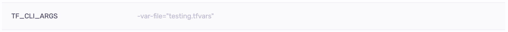
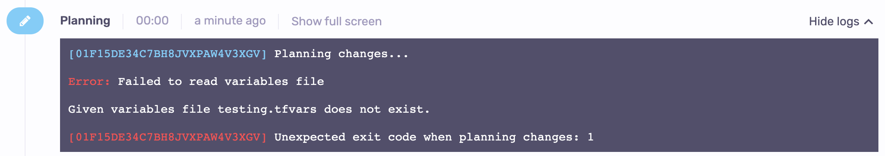

# Handling .tfvars

For some of our OpenTofu/Terraform users, the most convenient solution to configure a stack is to specify its input values in a variable definitions file that is then passed to OpenTofu/Terraform executions in _plan_ and _apply_ phases.

Spacelift supports this approach but does not provide a separate mechanism, depending instead on a combination of OpenTofu/Terraform's built-in mechanisms and Spacelift-provided primitives like:

- [environment variables](../../concepts/configuration/environment.md#environment-variables);
- [mounted files](../../concepts/configuration/environment.md#mounted-files)
- [`before_init`](../../concepts/configuration/runtime-configuration/README.md#before_init-scripts)scripts;

## Using environment variables

In OpenTofu/Terraform, special environment variables can be used to pass extra flags to executed commands like _plan_ or _apply_. These are the more generic [`TF_CLI_ARGS` and `TF_CLI_ARGS_name`](https://opentofu.org/docs/cli/config/environment-variables/#tf_cli_args-and-tf_cli_args_name){: rel="nofollow"} that only affect a specific command. In Spacelift, environment variables can be defined directly on stacks and modules, as well as on [contexts](../../concepts/configuration/context.md) attached to those. As an example, let's declare the following environment variable:

In our particular case we don't have this file checked in, so the run will fail:

But we can supply this file dynamically using [mounted files](../../concepts/configuration/environment.md#mounted-files) functionality.

## Using mounted files

If the variable definitions file is not part of the repo, we can inject it dynamically. The above example can be fixed by supplying the variables file at the requested path:

.png>)

Note that there are "magical" names you can give to your variable definitions files that always get autoloaded, without the need to supply extra CLI arguments. [According to the documentation](https://opentofu.org/docs/language/values/variables/#variable-definitions-tfvars-files){: rel="nofollow"}, OpenTofu/Terraform automatically loads a number of variable definitions files if they are present:

- Files named exactly `terraform.tfvars` or `terraform.tfvars.json`.
- Any files with names ending in `.auto.tfvars` or `.auto.tfvars.json`.

The above can be used in conjunction with another Spacelift building block, [`before_init` hooks](../../concepts/configuration/runtime-configuration/README.md#before_init-scripts).

## Using `before_init` hooks

If you need to use different variable definitions files for different projects, would like to have them checked into the repo, but would also want to avoid supplying extra CLI arguments, you could just dynamically move files - whether as a move, copy or a symlink to one of the autoloaded locations. This should happen in one of the `before_init` steps. Example:

