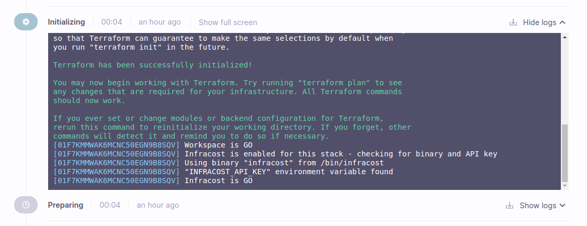
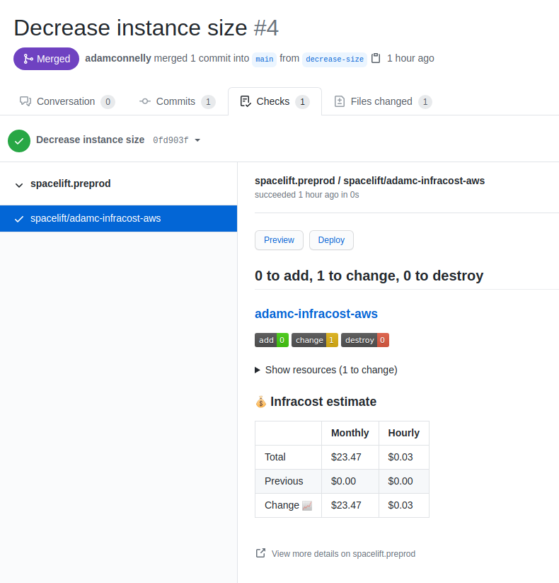
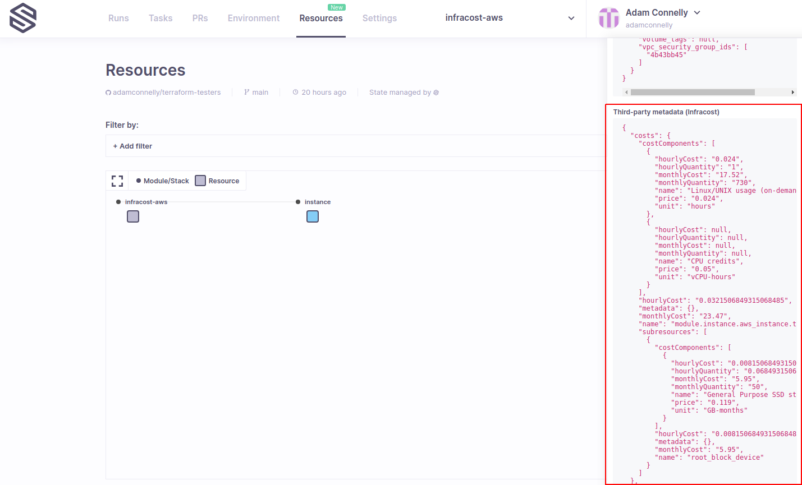

# Cost Estimation

The [Infracost](https://www.infracost.io) integration allows you to run an Infracost breakdown during Spacelift runs, providing feedback on PRs, and allowing you to integrate cost data with [plan policies](../../concepts/policy/terraform-plan-policy.md).

This allows you to understand how infrastructure changes will impact costs, and to build automatic guards to help prevent costs from spiraling out of control.

## Setting up the integration

To enable Infracost on any stack you need to do the following:

* Add the `infracost` label to the stack.
* Add an `INFRACOST_API_KEY` [environment variable](../../concepts/configuration/environment.md) containing your Infracost API key.

!!! info
    Creating a [context](../../concepts/configuration/context.md) for your Infracost API key means you can attach your key to any stacks that need to have Infracost enabled.

If Infracost has been configured successfully, you should see some messages during the initialization phase of your runs indicating that Infracost is enabled and that the environment variable has been found:



### Additional CLI Arguments

If you need to pass any additional CLI arguments to the Infracost breakdown command, you can add them to the `INFRACOST_CLI_ARGS` environment variable. Anything found in this variable is automatically appended to the command. This allows you to do things like specifying the path to your [Infracost usage file](https://www.infracost.io/docs/usage\_based\_resources#infracost-usage-file).

### Ignore Failures

By default, a failure executing Infracost, or a non-zero exit code being returned from the command will cause runs to fail.

This behavior can be changed by setting the `INFRACOST_WARN_ON_FAILURE` environment variable to `true`. When enabled, Infracost errors will produce a warning message, but will not cause run failures.

## Using the integration

Once the integration is configured, Spacelift will automatically run Infracost breakdowns during the planning and applying stages. The following sections explain the functionality provided by the integration.

### Pull Requests

Spacelift automatically posts the usage summary to your pull requests once Infracost is enabled:



### Plan Policies

Spacelift includes the full Infracost breakdown report in JSON format as part of the input to your plan policies. This is contained in `third_party_metadata.infracost`. The following shows an example plan input:

```javascript
{
  "cloudformation": null,
  "pulumi": null,
  "spacelift": { ... },
  "terraform": { ... },
  "third_party_metadata": {
    "infracost": {
      "projects": [{
        "breakdown": {
          "resources": [...],
          "totalHourlyCost": "0.0321506849315068485",
          "totalMonthlyCost": "23.47"
        },
        "diff": {
          "resources": [...],
          "totalHourlyCost": "0.0321506849315068485",
          "totalMonthlyCost": "23.47"
        },
        "metadata": {},
        "pastBreakdown": {
          "resources": [],
          "totalHourlyCost": "0",
          "totalMonthlyCost": "0"
        },
        "path": "/tmp/spacelift-plan923575332"
      }],
      "resources": [...],
      "summary": {
        "unsupportedResourceCounts": {}
      },
      "timeGenerated": "2021-06-09T14:14:44.146230883Z",
      "totalHourlyCost": "0.0321506849315068485",
      "totalMonthlyCost": "23.47",
      "version": "0.1"
    }
  }
}
```

This means that you can take cost information into account when deciding whether to ask for human approval or to block changes entirely. The following policy provides a simple example of this:

```perl
package spacelift

# Prevent any changes that will cause the monthly cost to go above a certain threshold
deny[sprintf("monthly cost greater than $%d ($%.2f)", [threshold, monthly_cost])] {
  threshold := 100
  monthly_cost := to_number(input.third_party_metadata.infracost.projects[0].breakdown.totalMonthlyCost)
  monthly_cost > threshold
}

# Warn if the monthly costs increase more than a certain percentage
warn[sprintf("monthly cost increase greater than %d%% (%.2f%%)", [threshold, percentage_increase])] {
  threshold := 5
  previous_cost := to_number(input.third_party_metadata.infracost.projects[0].pastBreakdown.totalMonthlyCost)
  previous_cost > 0

  monthly_cost := to_number(input.third_party_metadata.infracost.projects[0].breakdown.totalMonthlyCost)
  percentage_increase := ((monthly_cost - previous_cost) / previous_cost) * 100

  percentage_increase > threshold
}
```

### Resources View

Infracost provides information about how individual resources contribute to the overall cost of the stack. Spacelift combines this information with our [resources view](../../concepts/resources.md) to allow you to view the cost information for each resource:


