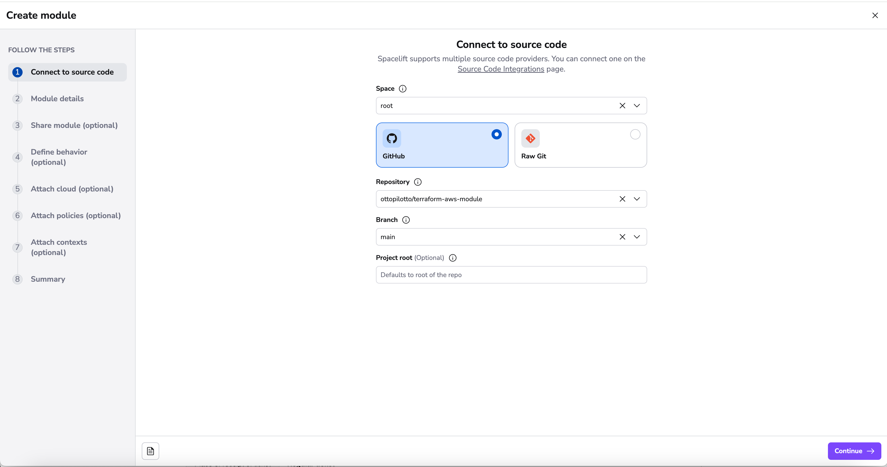
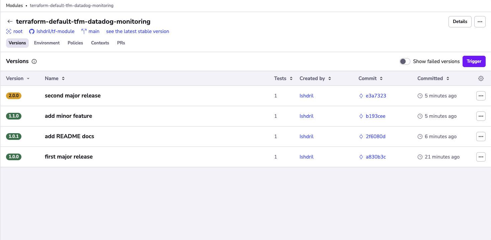
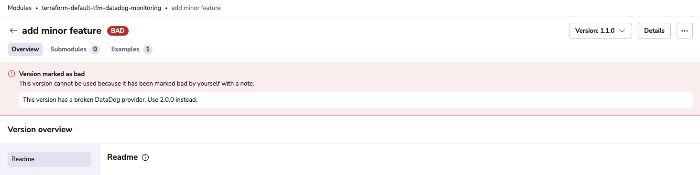
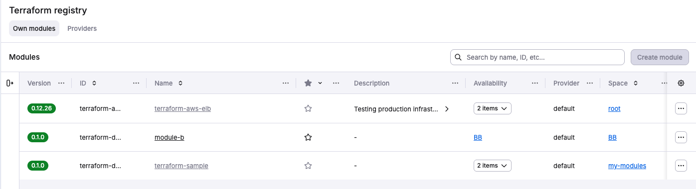
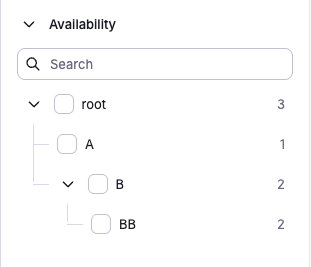

# Module registry


!!! Info
    This feature is only available to paid Spacelift accounts. Please check out our [pricing page](https://spacelift.io/pricing){: rel="nofollow"} for more information.


## Intro

In Terraform, [modules](https://www.terraform.io/docs/configuration/modules.html){: rel="nofollow"} help you abstract away common functionality in your infrastructure.

The name of a module managed by Spacelift is of the following form:

```text
spacelift.io/<organization>/<module_name>/<provider>
```

In this name we have:

- The source module registry - `spacelift.io` is used here;
- The organization which owns and maintains the module;
- The module name, this will usually be the best shorthand descriptor of what the module actually does, i.e. it could be starting a machine with an HTTP server running.
- The main Terraform provider this module is meant to work with, i.e. the provider for the cloud service the resources should be created on.

You can use a module in your Terraform configuration this way:

```terraform
module "my-birthday-cake" {
  source  = "spacelift.io/spacelift-io/cake/oven"
  version = "4.2.0"

  # Inputs.
  eggs  = 5
  flour = "200g"
}

output "my-birthday-cake" {
  value = {
    weight = module.my-birthday-cake.weight
    allergens = module.my-birthday-cake.allergens
  }
}
```

As you can see, we've explicitly used a module which can make cakes using an oven. We can specify variables the module depends on, and finally use the outputs the cake module exports.

Spacelift obviously lets you host modules, but it also does much more, providing you with robust CI/CD for your modules, leading us to the question...

### Why host your Modules on Spacelift?

Spacelift provides everything you need to make your module easily maintainable and usable. There is CI/CD for multiple specified versions of Terraform, which "runs" your module on each commit. You get an autogenerated page describing your Module and its intricacies, so your users can explore them and gather required information at a glimpse. It's also deeply integrated with all the features [Stacks](../../concepts/stack/README.md) use which you know and love, like [Environments](../../concepts/configuration/environment.md), [Policies](../../concepts/policy/README.md), [Contexts](../../concepts/configuration/context.md) and [Worker Pools](../../concepts/stack/stack-settings.md#worker-pool).

## Setting up a Module

### Git repository structure

You will have to set up a repository for your module, the structure of the repository should be as follows:

```bash
.
├── .spacelift
│   ├── config.yml
├── README.md
├── main.tf
├── output.tf
└── variables.tf
```

Each module must have a `config.yml` file in its `.spacelift` directory, containing information about the module along with any test cases. Details of the format of this file can be found in the [module configuration](module-registry.md#module-configuration) section of this page.

You can check out an example module here: [https://github.com/spacelift-io/terraform-spacelift-example](https://github.com/spacelift-io/terraform-spacelift-example){: rel="nofollow"}

!!! info
    The source code for a module can be stored in a subdirectory of your repository because you can specify the project root when configuring your module in Spacelift. An example of a repository containing multiple modules can be found here: [https://github.com/spacelift-io/multimodule](https://github.com/spacelift-io/multimodule){: rel="nofollow"}

### Spacelift setup

In order to add a module to Spacelift, navigate to the _Terraform registry_ section of the account view, and click the _Create module_ button:


The setup steps are pretty similar to the ones for [stacks](../../concepts/stack/README.md).

#### Connect to source code

{ .on-glb }

First, point Spacelift at the right repo and choose the "[tracked](../../concepts/stack/stack-settings.md#vcs-integration-and-repository)" branch - note that repositories whose names don't follow the convention are filtered out:

#### Add details

{ .on-glb }

In the details section, you will be able to add a **name**, **provider**, [labels](../../concepts/stack/stack-settings.md#labels) and [description](../../concepts/stack/stack-settings.md#name-and-description).

The name and provider will be inferred from your repository name if it follows the `terraform-<provider>-<name>` convention. However, if it can't be inferred or you want a custom name, you can specify them directly. The final module slug will then be based on the name and provider preceded by `terraform-` prefix, like this `terraform-<provider>-<name>`.

#### Module Created

{ .on-glb }

 After finishing adding details to your module, you're brought to a new screen indicating that your module has been successfully created. This screen serves as a branching point where you can enhance the functionality of your module through various integrations and customizations.

You have the flexibility to either take shortcuts to specific configurations or continue through the standard process of setting up your module.

#### Define module availability

{ .on-glb }

In this step, you can make your module available to specific spaces in your account. Select the spaces that should have access to use this module in their stacks.

Modules become discoverable and usable by stacks in the selected spaces, while module management remains with the owner. Learn more about [module availability](#module-availability).

#### Define behavior

{ .on-glb }

In the behavior section there are few settings that you can set to make your module work in a specific way:

- setting the [worker pool](../../concepts/worker-pools#using-worker-pools) to one you manage yourself makes sense if the module tests will be touching resources or accounts you don't want Spacelift to access directly. Plus, your private workers may have more bandwidth than the shared ones, so you may get feedback faster.
- which tool to be used to execute the workflow commands. This can be an open source (FOSS) version of Terraform, OpenTofu or a custom tool.
- a docker image used to process your module metadata. You can specify your own image or use Spacelift's public one: `public.ecr.aws/spacelift/runner-terraform:latest`. Setting this is the only way to enable the use of symbolic links in the module.
- whether the module is [administrative](../../concepts/stack/stack-settings.md#administrative) (You will only need to set _administrative_ to `true` if your module manages Spacelift resources (and most likely it does not)),
- whether or not to enable the local preview [spacectl](https://github.com/spacelift-io/spacectl){: rel="nofollow"} CLI feature;
- whether or not to protect the module from deletion;

#### Attach Module Cloud Integration

{ .on-glb }

Here you have the ability to attach any Cloud Integrations you have configured.

Cloud integrations allow Spacelift to manage your resources without the need for long-lived static credentials.

Spacelift integrates with identity management systems from major cloud providers to dynamically generate short-lived access tokens that can be used to configure their corresponding Terraform providers.

Currently, AWS, Azure and GCP are natively supported.

AWS and Azure integrations can also be auto-attached. To do so, add a label to your module that matches the `autoattach_label` in your integrations.

You can read more about Cloud integrations [here](../../integrations/cloud-providers/README.md).

#### Attach Module Policies

{ .on-glb }

Spacelift as a development platform is built around the concept of policies and allows defining policies that involve various decision points in the application.

In this section, you can attach the following policy types:

- [Approval:](../../concepts/policy/approval-policy.md) who can approve or reject a run and how a run can be approved;
- [Plan:](../../concepts/policy/terraform-plan-policy.md) which changes can be applied;
- [Push:](../../concepts/policy/push-policy/README.md) how Git push events are interpreted;
- [Trigger:](../../concepts/policy/trigger-policy.md) what happens when blocking runs terminate;

Policies can be automatically attached to module using the `autoattach:label` special label where `label` is the name of a label attached to stacks and/or modules in your Spacelift account you wish the policy to be attached to.

You can read more about policies [here](../../concepts/policy/README.md).

#### Attach Module Contexts

{ .on-glb }

Contexts are sets of environment variables and related configuration including hooks that can be shared across multiple modules. By attaching a context, you ensure your module has all the necessary configuration elements it needs to operate, without repeating the setup for each module.

Contexts can be automatically attached to modules using the `autoattach:label` special label where `label` is the name of a label attached to stacks and/or modules in your Spacelift account you wish the context to be attached to.

You can read more about contexts [here](../../concepts/configuration/context.md).

#### Summary

{ .on-glb }

 On the summary section, you can now review your settings before finalizing the creation of your module. This modular approach ensures your module gets set up with all the necessary components.

### Environment, contexts and policies

[Environment](../../concepts/configuration/environment.md) and [context](../../concepts/configuration/context.md) management in modules is identical to that for [stacks](../../concepts/stack/README.md). The only thing worth noting here is the fact that environment variables and mounted files set either through the module environment directly, or via one of its attached contexts will be passed to each of the [test cases](module-registry.md#tests) for the module.

Attaching policies works in a similar way. One thing worth pointing out is that the behavior of [Trigger policies](../../concepts/policy/trigger-policy.md#module-updates) are slightly different for modules. Instead of being provided with the list of all other accessible stacks, module trigger policies receive a list of the current consumers of the module. This allows you to automatically trigger dependent stacks when new module versions are published.

## Module configuration

!!! Tip
    If you get the error `couldn't create version: could not create version: version "0.1.0" already exists for spacelift-modules` potentially it could be that your config.yml file is in the wrong location or named something else eg. config.yaml instead.  Modules will initially be created with version "0.1.0" if Spacelift cannot read that file version for whatever reason

While by convention a single Git repository hosts a single module, that root module can have multiple submodules. Thus, we've created a way to create a number of test cases:

```yaml
# The version of the configuration file format
version: 1
# Your module version - must be changed to release a new version
module_version: 0.1.1

# Any default settings that should be used for all test cases
test_defaults:
  before_init: ["terraform fmt -check"]
  runner_image: your/runner:image

# The set of tests to run to verify your module works correctly
tests:
  - name: Test the module with 0.12.7
    terraform_version: 0.12.7
    environment:
      TF_VAR_bacon: tasty

  - name: Test the submodule with 0.13.0
    # project_root can be set if your test case is not stored in the root directory
    project_root: submodule
    terraform_version: 0.13.0
    environment:
      TF_VAR_cabbage: awful

  - name: Ensure that the submodule can fail
    # You can use negative to indicate that the test case is expected to fail
    negative: true
    project_root: submodule
    terraform_version: 0.13.0
```

This configuration is nearly identical to the one described in the [Runtime configuration](../../concepts/configuration/runtime-configuration/README.md) section, with both `test_defaults` and each test case accepting the same configuration block. Note that settings explicitly specified in each test case will override those in the `test_defaults` section. Also, notice that each test case has a **name**, which is a **required field**.

!!! info
    While we don't check for name uniqueness, it's always good idea to give your test cases descriptive names, as these are then used to report job status on your commits and pull requests.

## Tests

In order to verify that your module is working correctly, Spacelift can run a number of test cases for your module. Note how the configuration above allows you to set up different runtime environment (Docker image, Terraform version) etc. If you want to test the module with different inputs, these can be passed as Terraform variables (starting with `TF_VAR_`) through the test-level `environment` configuration option - see above for an example.

While coverage is not yet calculated or enforced, we suggest that tests set up all resources defined by the module and submodules. It's generally a good idea to provide examples in the `examples/` directory of your repository showing users how they can use the module in practice. These examples can then become your test cases, and you can test them against multiple supported Terraform version to maximize compatibility.

While running each test case, Spacelift will - as usual, initialize, plan and apply the resource, but also destroy everything in the end, checking for errors. In the meantime, it will also validate that some resources have actually been created by the tests - though as for now it does not care what these are.

A test case can be marked as `negative`, which means that it is expected to fail. In an example above one of the test cases is expected to fail if one of the required Terraform variables is not set. Negative test cases are as useful as positive ones because they can prove that the module will not work under certain - unexpected or erroneous - circumstances.

Test cases will be executed in parallel (as much as worker count permits) for each of the test cases version you have specified in the module configuration.

Tests run both on [proposed and tracked changes](../../concepts/run/README.md#where-do-runs-come-from). When a tracked change occurs, we create a Version. Versions are described in more detail in the [Versions section](module-registry.md#versions).

!!! info
    Each test case will have its own commit status in GitHub / GitLab.

## Test case ordering

You can specify the order in which test cases should be executed by setting the `depends_on` property on a test case. This property accepts a list of test case `id`s that must be executed before the current test case. For example:

```yaml
version: 1
module_version: 1.0.0

tests:
  # This one is executed first.
  - name: Test the module with 0.12.7
    id: test-0.12.7
    terraform_version: 0.12.7

  # This is executed second, because it depends on the first test case.
  - name: Test the submodule with 0.13.0
    id: test-0.13.0
    project_root: submodule
    terraform_version: 0.13.0
    depends_on: ["test-0.12.7"]

  # This is executed third, because it depends on the second test case.
  - name: Ensure that the submodule can fail
    depends_on: ["test-0.13.0"]
    negative: true
    project_root: submodule
```

Note that in order to refer to a test case, you need to set a unique `id` to it.

## Versions

!!! tip
    If you would like to import old module versions, you can use a bash script that lists the tags in the repo and then use [spacectl](https://github.com/spacelift-io/spacectl){: rel="nofollow"}: `spacectl module create-version --id <MODULE ID> --sha <COMMIT SHA> --version <MODULE VERSION>`

Whenever tests succeed on a [tracked change](../../concepts/run/README.md#where-do-runs-come-from), a new **Version** is created based on the `module_version` in the configuration. Important thing to note is that Spacelift will not let you reuse the number of a successful version, and will require you to strictly follow semantic versioning - ie. you can't go to from `0.2.0` to `0.4.0`, skipping `0.3.0` entirely.

{ .on-glb }

Two proposed git flow are as follows:

The first one would be to have a main branch and create feature branches for changes. Whenever you merge to the main branch you bump the version and release it.

If you'd like to ensure that the version is bumped before merging, we recommend adding something similar to your CI/CD pipeline:

```bash
git diff --exit-code --quiet HEAD^ HEAD -- .spacelift/config.yml

if [ $? -ne 0 ]; then
  echo "Make sure to bump the module version in .spacelift/config.yml"
  exit 1
fi
```

If you want more control over release schedules, you could go with the following:

- A release branch
- A main branch
- Feature branches

Whenever you add a new functionality, you may want to create a feature branch and open Pull Request from it to the main branch. Whenever you want to release a new version, you merge the main branch into the release branch.

You can also use [Git push policies](../../concepts/policy/push-policy/README.md) to further customize this.

!!! Tip
    If you would like to manage your Terraform Module versions using git tags, and would like git tag events to push your module to the Spacelift module registry. Please review our [Tag-driven Terraform Module Release Flow](../../concepts/policy/push-policy/README.md#tag-driven-terraform-module-release-flow).

!!! info
    If no test cases are present, the version is immediately marked green.

## Marking versions as bad

!!! warning
    Marking a version as bad cannot be undone.

If you don't want people to use a specific version of your module, you can mark it as bad. Currently, this feature **doesn't have any technical implications** - it is still downloadable and usable, but it's a good way to communicate to your users that a specific version is not recommended.

You can mark a version as bad using the dropdown menu on the right side of the versions list or in the version details view. Make sure to leave a note explaining why the version is bad.


You'll be able to see in the version details that the version has been **marked as bad** and the description.

{ .on-glb }

## Modules in practice

In order to use modules, you have to source them from the Spacelift module registry. You can generate the necessary snippet, by opening the page of the specific module version, and clicking **show instructions**.

.png>)

!!! info
    Stacks that use private modules need access to the Space the modules reside in, which can be achieved via [space inheritance](../../concepts/spaces/access-control.md#inheritance) or module [space availability](#space-availability).

### Module availability

#### Space availability

Modules can be made available to specific spaces within your account, giving you fine-grained control over which teams can discover and use your modules. When you make a module available to a space, any stack in that space can reference it in their Terraform configurations.

When you make a module available to a space, all child spaces with [inheritance enabled](../../concepts/spaces/access-control.md#inheritance) will also be able to access the module.

To make a module available to other spaces, select the target spaces in the availability section under **Module settings > Availability**


This can also be accomplished programmatically using our [Terraform provider](terraform-provider.md) via the `space_shares` attribute:

```hcl
resource "spacelift_space" "frontend_team" {
  name = "frontend-team"
}

resource "spacelift_space" "backend_team" {
  name = "backend-team"
}

# Platform module owned by root space, made available to application teams
resource "spacelift_module" "common_networking" {
  name       = "networking"
  branch     = "main"
  repository = "terraform-networking"

  space_shares = [
    spacelift_space.frontend_team.id,
    spacelift_space.backend_team.id,
  ]
}
```

The `space_shares` attribute accepts a list of space IDs. Changes to this list will update module availability, allowing you to manage module access as code.

##### Permissions

To be able to make a module available to a space, you need the following permissions:

- **Admin** access on the space where the module belongs.
- **Write** access OR the `SPACE_SHARE_MODULE` action to the target space.

You may also want to assign read access to the target space, otherwise the space will not appear in the space selector in Spacelift UI.
You can create a custom role called `module share` like below that you can reuse:


##### Using available modules

When a module is made available to a space you have access to, you can:

- Discover it in the module list and search results.
- Reference it in your stack configurations.

Module management remains with the owner. You cannot see module details, modify settings, create versions, or change availability configuration for modules exposed to you.

##### Finding available modules

The module list includes both modules you own and modules that have been made available to you.

{ .on-glb }

Modules made available to you are greyed out because the only thing you can do with them is consume them from your stacks.

You can use the **availability filter** to filter by specific spaces to see what's available and where.



This helps module owners see which spaces can access their modules, and helps consumers find the modules they can use.

##### When to use space availability

Space availability is the recommended approach for most organizations. Use it when:

- Different teams within your account need access to different module sets.
- You want centralized governance over who can use which modules.

For example, your platform team might maintain networking and security modules in a dedicated space, then make them available selectively to specific application team spaces.

#### Cross-account sharing

!!! warning "Migrating from cross-account sharing"
    If you're currently sharing modules between accounts, consider consolidating into a single account with space-based organization. This provides better visibility, simpler access control, and improved governance.

    **Cross account sharing might be deprecated in the future**

Cross-account sharing is supported for backwards compatibility and specific multi-account scenarios, but space availability is recommended for new implementations.

Consider cross-account sharing only if you manage completely separate Spacelift accounts that need to share modules.

#### Public modules

Public modules are accessible to anyone, including users outside your Spacelift account. This is appropriate for open-source modules you want to share with the broader community.

To make a module public, use the `public` attribute in the [Terraform provider](https://registry.terraform.io/providers/spacelift-io/spacelift/latest/docs/resources/module):

```hcl
resource "spacelift_module" "public_example" {
  name       = "example"
  branch     = "main"
  repository = "terraform-aws-example"
  public     = true
}
```

!!! warning
    Public modules are discoverable and usable by anyone. Only mark modules as public if you intend to share them with the community.

### Using modules outside of Spacelift

Modules hosted in the private registry can be used outside of Spacelift.

The easiest way is to have Terraform retrieve and store the credentials by running the following command in a terminal:

```shell
terraform login spacelift.io
```

After you confirm that you want to proceed, Terraform will open your default web browser and ask you to log in to your Spacelift account. Once this is done, Terraform will store the credentials in the `~/.terraform.d/credentials.tfrc.json` file for use by subsequent commands.

!!! warning

    The method above requires a web browser which is not always practical, for example on remote server with no GUI. In that case, you can use credentials generated from [API keys](../../integrations/api.md#spacelift-api-key-token). The credentials file generated upon the creation of each API key contains a section explaining how a key can be used to set up credentials in the Terraform configuration file (`.terraformrc`). To learn more about this please [refer directly to Terraform documentation](https://www.terraform.io/docs/commands/cli-config.html){: rel="nofollow"}.

### Dependabot

If you want to use [Dependabot](https://github.com/dependabot){: rel="nofollow"} to automatically update your module versions, you can use the following `dependabot.yml` [configuration](https://docs.github.com/en/code-security/dependabot/dependabot-version-updates/configuring-dependabot-version-updates){: rel="nofollow"}:



```yaml
version: 2
registries:
  spacelift-private-registry:
    type: terraform-registry
    url: https://app.spacelift.io
    token: ${{ secrets.SPACELIFT_TOKEN }}
updates:
  - package-ecosystem: "terraform"
    directory: "/"
    registries:
      - spacelift-private-registry
    schedule:
      interval: "daily"
```



Please refer to the important [notes](#important-notes) for more information.

### Renovate

If you want to use [Renovate](https://github.com/renovatebot/renovate){: rel="nofollow"} to automatically update your module versions, you can use the following `renovate.json` [configuration](https://docs.renovatebot.com/configuration-options/){: rel="nofollow"}:



```json
{
  "$schema": "https://docs.renovatebot.com/renovate-schema.json",
  "hostRules": [
    {
      "matchHost": "app.spacelift.io",
      "encrypted": {
        "token": "<SPACELIFT_TOKEN>"
      },
      "hostType": "terraform-module"
    }
  ],
  "packageRules": [
    {
      "matchDatasources": [
        "terraform-module"
      ],
      "registryUrls": [
        "https://app.spacelift.io"
      ]
    }
  ]
}
```



### Important notes

- It is important for the `url` to be `https://app.spacelift.io` and for the `token` to be a [Spacelift API key](../../integrations/api.md#spacelift-api-key-token).

- `Spacelift Token` should be the token that is used for accessing Spacelift-hosted Terraform modules outside of Spacelift.

```text
Please use the following API secret when communicating with Spacelift
programmatically:

<NotThisValue>

Please add this snippet to your .terraformrc file if you want to use this API
key to access Spacelift-hosted Terraform modules outside of Spacelift:

credentials "spacelift.io" {
  token = <ThisValue>
}
```

- Your API key needs to have read permissions to the space your module lives in at a minimum.

- If you are using login policies, non-admin keys must be defined within this policy. An example snipprt of this is below;

```opa
allow {
    input.session.login == "api::01234"
 }

 space_read["spaceid"] {
     input.session.login == "api::01234"
 }
```

!!! info

    If you are receiving an empty list of modules, it is likely that the api token does not have the correct access to the space.
