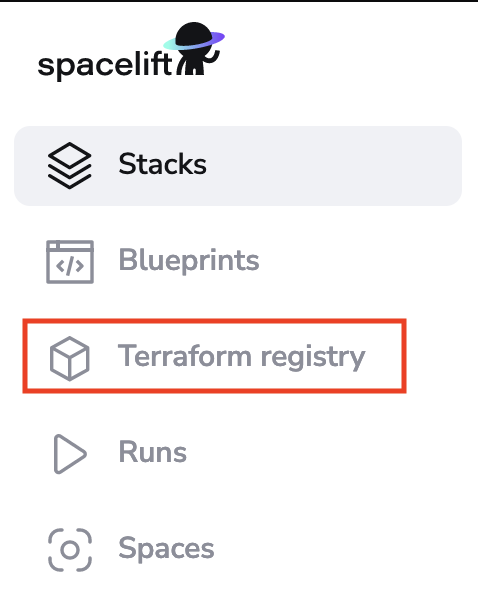
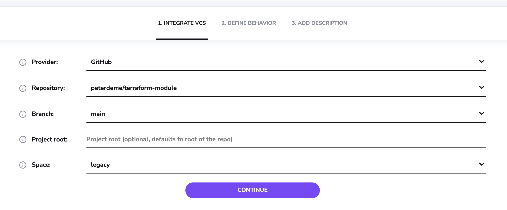
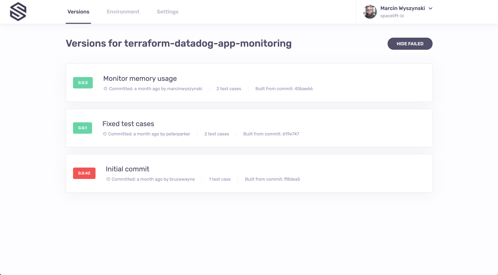
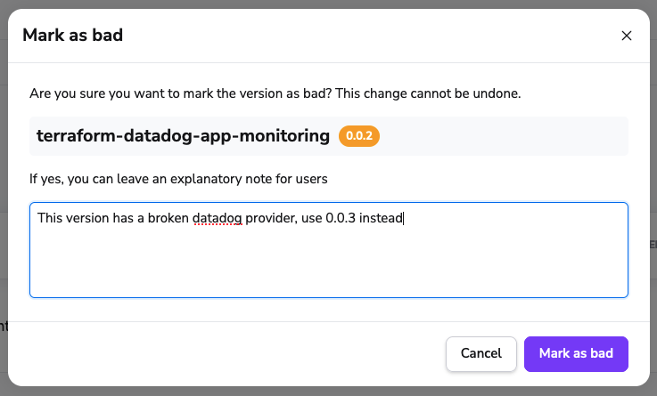

# Module registry

## Intro

In Terraform, [modules](https://www.terraform.io/docs/configuration/modules.html){: rel="nofollow"} help you abstract away common functionality in your infrastructure.

The name of a module managed by Spacelift is of the following form:

```text
spacelift.io/<organization>/<module_name>/<provider>
```

In this name we have:

- The source module registry - `spacelift.io` is used here;
- The organization which owns and maintains the module;
- The module name, this will usually be the best shorthand descriptor of what the module actually does, i.e. it could be starting a machine with an HTTP server running.
- The main Terraform provider this module is meant to work with, i.e. the provider for the cloud service the resources should be created on.

You can use a module in your Terraform configuration this way:

```terraform
module "my-birthday-cake" {
  source  = "spacelift.io/spacelift-io/cake/oven"
  version = "4.2.0"

  # Inputs.
  eggs  = 5
  flour = "200g"
}

output "my-birthday-cake" {
  value = {
    weight = module.my-birthday-cake.weight
    allergens = module.my-birthday-cake.allergens
  }
}
```

As you can see, we've explicitly used a module which can make cakes using an oven. We can specify variables the module depends on, and finally use the outputs the cake module exports.

Spacelift obviously lets you host modules, but it also does much more, providing you with robust CI/CD for your modules, leading us to the question...

### Why host your Modules on Spacelift?

Spacelift provides everything you need to make your module easily maintainable and usable. There is CI/CD for multiple specified versions of Terraform, which "runs" your module on each commit. You get an autogenerated page describing your Module and its intricacies, so your users can explore them and gather required information at a glimpse. It's also deeply integrated with all the features [Stacks](../../concepts/stack/README.md) use which you know and love, like [Environments](../../concepts/configuration/environment.md), [Policies](../../concepts/policy/README.md), [Contexts](../../concepts/configuration/context.md) and [Worker Pools](../../concepts/stack/stack-settings.md#worker-pool).

## Setting up a Module

### Git repository structure

You will have to set up a repository for your module, the structure of the repository should be as follows:

```bash
.
├── .spacelift
│   ├── config.yml
├── README.md
├── main.tf
├── output.tf
└── variables.tf
```

Each module must have a `config.yml` file in its `.spacelift` directory, containing information about the module along with any test cases. Details of the format of this file can be found in the [module configuration](module-registry.md#module-configuration) section of this page.

You can check out an example module here: [https://github.com/spacelift-io/terraform-spacelift-example](https://github.com/spacelift-io/terraform-spacelift-example)

!!! info
    The source code for a module can be stored in a subdirectory of your repository because you can specify the project root when configuring your module in Spacelift. An example of a repository containing multiple modules can be found here: [https://github.com/spacelift-io/multimodule](https://github.com/spacelift-io/multimodule)

### Spacelift setup

In order to add a module to Spacelift, navigate to the _Terraform registry_ section of the account view, and click the _Add module_ button:



The setup steps are pretty similar to the ones for [stacks](../../concepts/stack/README.md). First you you point Spacelift at the right repo and choose the "[tracked](../../concepts/stack/stack-settings.md#repository-and-branch)" branch - note that repositories whose name don't follow the convention are filtered out:



In the behavior section there are just three settings: [administrative](../../concepts/stack/README.md#administrative), [worker pool](../../concepts/worker-pools.md#using-worker-pools) and  **project root**. You will only need to set _administrative_ to `true` if your module manages Spacelift resources (and most likely it does not). Setting worker pool to the one you manage yourself makes sense if the module tests will be touching resources or accounts you don't want Spacelift to access directly. Plus, your private workers may have more bandwidth than the shared ones, so you may get feedback faster. The project root let's you specify the module source code root inside of your repository:

.png>)

Last but not least, you will be able to add a **name**, **provider**, [labels](../../concepts/stack/README.md#labels) and [description](../../concepts/stack/README.md#name-and-description).

.png>)

The name and provider will be inferred from your repository name if it follows the `terraform-<provider>-<name>` convention. However, if it can't be inferred or you want a custom name, then you can specify them directly. The final module slug will then be based on the name.

### Environment, contexts and policies

[Environment](../../concepts/configuration/environment.md) and [context](../../concepts/configuration/context.md) management in modules is identical to that for [stacks](../../concepts/stack/README.md). The only thing worth noting here is the fact that environment variables and mounted files set either through the module environment directly, or via one of its attached contexts will be passed to each of the [test cases](module-registry.md#tests) for the module.

Attaching policies works in a similar way. One thing worth pointing out is that the behavior of [Trigger policies](../../concepts/policy/trigger-policy.md#module-updates) are slightly different for modules. Instead of being provided with the list of all other accessible stacks, module trigger policies receive a list of the current consumers of the module. This allows you to automatically trigger dependent stacks when new module versions are published.

## Module configuration

While by convention a single Git repository hosts a single module, that root module can have multiple submodules. Thus, we've created a way to create a number of test cases:

```yaml
# The version of the configuration file format
version: 1
# Your module version - must be changed to release a new version
module_version: 0.1.1

# Any default settings that should be used for all test cases
test_defaults:
  before_init: ["terraform fmt -check"]
  runner_image: your/runner:image

# The set of tests to run to verify your module works correctly
tests:
  - name: Test the module with 0.12.7
    terraform_version: 0.12.7
    environment:
      TF_VAR_bacon: tasty

  - name: Test the submodule with 0.13.0
    # project_root can be set if your test case is not stored in the root directory
    project_root: submodule
    terraform_version: 0.13.0
    environment:
      TF_VAR_cabbage: awful

  - name: Ensure that the submodule can fail
    # You can use negative to indicate that the test case is expected to fail
    negative: true
    project_root: submodule
    terraform_version: 0.13.0
```

This configuration is nearly identical to the one described in the [Runtime configuration](../../concepts/configuration/runtime-configuration/README.md) section, with both `test_defaults` and each test case accepting the same configuration block. Note that settings explicitly specified in each test case will override those in the `test_defaults` section. Also, notice that each test case has a **name**, which is a **required field**.

!!! info
    While we don't check for name uniqueness, it's always good idea to give your test cases descriptive names, as these are then used to report job status on your commits and pull requests.

## Tests

In order to verify that your module is working correctly, Spacelift can run a number of test cases for your module. Note how the configuration above allows you to set up different runtime environment (Docker image, Terraform version) etc. If you want to test the module with different inputs, these can be passed as Terraform variables (starting with `TF_VAR_`) through the test-level `environment` configuration option - see above for an example.

While coverage is not yet calculated or enforced, we suggest that tests set up all resources defined by the module and submodules. It's generally a good idea to provide examples in the `examples/` directory of your repository showing users how they can use the module in practice. These examples can then become your test cases, and you can test them against multiple supported Terraform version to maximize compatibility.

While running each test case, Spacelift will - as usual, initialize, plan and apply the resource, but also destroy everything in the end, checking for errors. In the meantime, it will also validate that some resources have actually been created by the tests - though as for now it does not care what these are.

A test case can be marked as `negative`, which means that it is expected to fail. In an example above one of the test cases is expected to fail if one of the required Terraform variables is not set. Negative test cases are as useful as positive ones because they can prove that the module will not work under certain - unexpected or erroneous - circumstances.

Test cases will be executed in parallel (as much as worker count permits) for each of the test cases version you have specified in the module configuration.

Tests run both on [proposed and tracked changes](../../concepts/run/README.md#where-do-runs-come-from). When a tracked change occurs, we create a Version. Versions are described in more detail in the [next section](module-registry.md#tests).

!!! info
    Each test case will have its own commit status in GitHub / GitLab.

## Test case ordering

You can specify the order in which test cases should be executed by setting the `depends_on` property on a test case. This property accepts a list of test case `id`s that must be executed before the current test case. For example:

```yaml
version: 1
module_version: 1.0.0

tests:
  # This one is executed first.
  - name: Test the module with 0.12.7
    id: test-0.12.7
    terraform_version: 0.12.7

  # This is executed second, because it depends on the first test case.
  - name: Test the submodule with 0.13.0
    id: test-0.13.0
    project_root: submodule
    terraform_version: 0.13.0
    depends_on: ["test-0.12.7"]

  # This is executed third, because it depends on the second test case.
  - name: Ensure that the submodule can fail
    depends_on: ["test-0.13.0"]
    negative: true
    project_root: submodule
```

Note that in order to refer to a test case, you need to set a unique `id` to it.

## Versions

Whenever tests succeed on a [tracked change](../../concepts/run/README.md#where-do-runs-come-from), a new **Version** is created based on the `module_version` in the configuration. Important thing to note is that Spacelift will not let you reuse the number of a successful version, and will require you to strictly follow semantic versioning - ie. you can't go to from `0.2.0` to `0.4.0`, skipping `0.3.0` entirely.



Two proposed git flow are as follows:

The first one would be to have a main branch and create feature branches for changes. Whenever you merge to the main branch you bump the version and release it.

If you want more control over release schedules, you could go with the following:

- A release branch
- A main branch
- Feature branches

Whenever you add a new functionality, you may want to create a feature branch and open Pull Request from it to the main branch. Whenever you want to release a new version, you merge the main branch into the release branch.

You can also use [Git push policies](../../concepts/policy/git-push-policy.md) to further customize this.

!!! info
    If no test cases are present, the version is immediately marked green.

## Marking versions as bad

If you don't want people to use a specific version of your module, you can mark it as bad. Currently, this feature **doesn't have any technical implications** - it is still downloadable and usable, but it's a good way to communicate to your users that a specific version is not recommended.

You need to click on the version number and then click on the **Mark as bad** button on the right. Make sure to leave a note explaining why the version is bad.



## Modules in practice

In order to use modules, you have to source them from the Spacelift module registry. You can generate the necessary snippet, by opening the page of the specific module version, and clicking **show instructions**.

.png>)

### Sharing modules

Unlike Stacks, modules can be shared between Spacelift accounts in a sense that while they're always **managed** by a single account, they can be made accessible to an arbitrary number of other accounts.

In order to share the module with other accounts, please add their names in subdomain form (all lowercase) in the module settings Sharing section:


This can also be accomplished programmatically using our [Terraform provider](terraform-provider.md).

### Using modules outside of Spacelift

Modules hosted in the private registry can be used outside of Spacelift.

The easiest way is to have Terraform retrieve and store the credentials by running the following command in a terminal:

```shell
terraform login spacelift.io
```

After you confirm that you want to proceed, Terraform will open your default web browser and ask you to log in to your Spacelift account. Once this is done, Terraform will store the credentials in the `~/.terraform.d/credentials.tfrc.json` file for use by subsequent commands.

!!! warning

    The method above requires a web browser which is not always practical, for example on remote server with no GUI. In that case, you can use credentials generated from [API keys](../../integrations/api.md#spacelift-api-key-token). The credentials file generated upon the creation of each API key contains a section explaining how a key can be used to set up credentials in the Terraform configuration file (`.terraformrc`). To learn more about this please [refer directly to Terraform documentation](https://www.terraform.io/docs/commands/cli-config.html){: rel="nofollow"}.

### Dependabot

If you want to use [Dependabot](https://github.com/dependabot){: rel="nofollow"} to automatically update your module versions, you can use the following `dependabot.yml` [configuration](https://docs.github.com/en/code-security/dependabot/dependabot-version-updates/configuring-dependabot-version-updates){: rel="nofollow"}:

```yaml
version: 2
registries:
  spacelift-private-registry:
    type: terraform-registry
    url: https://app.spacelift.io
    token: ${{ secrets.SPACELIFT_TOKEN }}
updates:
  - package-ecosystem: "terraform"
    directory: "/"
    registries:
      - spacelift-private-registry
    schedule:
      interval: "daily"
```

It is important for the `url` to be `https://app.spacelift.io` and for the `token` to be a [Spacelift API key](../../integrations/api.md#spacelift-api-key-token). Admin access is not required.
