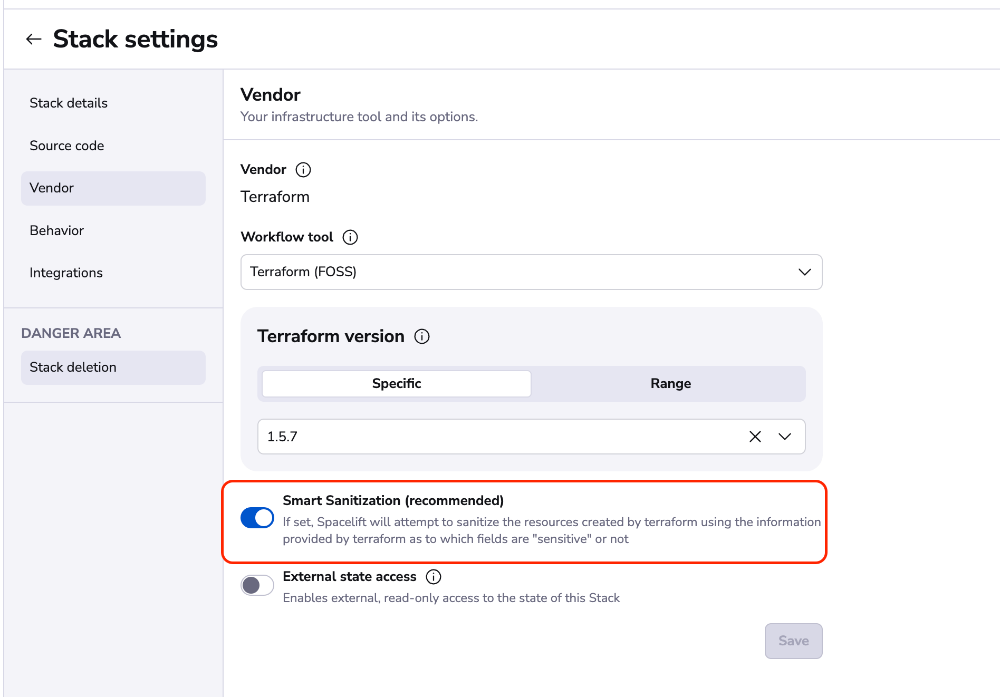

# Resource Sanitization

The OpenTofu/Terraform state can contain very sensitive data. Sometimes this is unavoidable because of the design of certain OpenTofu/Terraform providers or because the definition of what is sensitive isn't always simple and may vary between individuals and organizations.

Spacelift provides two different approaches for sanitizing values when resources are stored or passed to [Plan policies](../../concepts/policy/terraform-plan-policy.md):

- [Default Sanitization](#default-sanitization): All string values are sanitized.
- [Smart Sanitization](#smart-sanitization): Only the values marked as sensitive are sanitized.

For example, if we take the following definition for an AWS RDS instance:

```terraform
resource "aws_db_instance" "example" {
  allocated_storage    = 10
  db_name              = "exampledb"
  engine               = "mysql"
  engine_version       = "5.7"
  instance_class       = var.instance_class
  username             = var.username
  password             = var.password
  parameter_group_name = "default.mysql5.7"
  skip_final_snapshot  = true
}

variable "instance_class" {
  default     = "db.t3.micro"
  description = "Instance type"
  type        = string
}

variable "username" {
  description = "Admin username"
  sensitive   = true
  type        = string
}

variable "password" {
  description = "Admin password"
  sensitive   = true
  type        = string
}
```

Spacelift will supply something similar to the following to any plan policies:

=== "Default Sanitization"

    ```json
    {
      …
      "terraform": {
        "resource_changes": [
          {
            "address": "aws_db_instance.example",
            "change": {
              "actions": ["create"],
              "after": {
                "allocated_storage": 10,
                "db_name": "59832d41",
                "engine": "eae35047",
                "engine_version": "fc40d152",
                "instance_class": "4f8189cd",
                "parameter_group_name": "bead1390",
                "password": "c1707d9d",
                "skip_final_snapshot": true,
                "username": "6266e7ae",
                …
              },
              …
            },
            …
          }
        ]
      }
      …
    }
    ```

=== "Smart Sanitization"

    ```json
    {
      …
      "terraform": {
        "resource_changes": [
          {
            "address": "aws_db_instance.example",
            "change": {
              "actions": ["create"],
              "after": {
                "allocated_storage": 10,
                "db_name": "exampledb",
                "engine": "mysql",
                "engine_version": "5.7",
                "instance_class": "db.t3.micro",
                "parameter_group_name": "default.mysql5.7",
                "password": "c1707d9d",
                "skip_final_snapshot": true,
                "username": "6266e7ae",
                …
              },
              …
            },
            …
          }
        ]
      }
      …
    }
    ```

As you can see in the example above, with the Default Sanitization all string values are hashed which makes it difficult to comprehend logs, work with outputs/created resources, and write policies against the changes in your stacks. With Smart Sanitization, only sensitive values are hashed.

Smart Sanitization allows you to author [Plan policies](../../concepts/policy/terraform-plan-policy.md) against non-sensitive string values without the need for a call to the `sanitized()` function.

=== "Default Sanitization"

    ```opa
    package spacelift
    import future.keywords

    allowed_instance_classes := ["db.t3.micro", "db.t3.small", "db.t3.medium"]

    # The values have to be sanitized before they can be compared with the resource change value
    sanitized_allowed_instance_classes := {c | sanitized(allowed_instance_classes[_], c)}

    deny["Instance class is not allowed"] {
      resource := input.terraform.resource_changes[_]
      not resource.change.after.instance_class in sanitized_allowed_instance_classes
    }

    deny["Username cannot be 'admin'"] {
      resource := input.terraform.resource_changes[_]

      # The value has to be sanitized before they can be compared with the resource change value
      resource.change.after.username = sanitized("admin")
    }


    # Enable sampling to help us debug the policy
    sample { true }
    ```

=== "Smart Sanitization"

    ```opa
    package spacelift
    import future.keywords

    # No need to sanitize the values because the argument is not marked as sensitive
    allowed_instance_classes := ["db.t3.micro", "db.t3.small", "db.t3.medium"]

    deny["Instance class is not allowed"] {
      resource := input.terraform.resource_changes[_]
      not resource.change.after.instance_class in allowed_instance_classes
    }

    deny["Username cannot be 'admin'"] {
      resource := input.terraform.resource_changes[_]

      # The value has to be sanitized before it can be compared because the argument is marked as sensitive
      resource.change.after.username = sanitized("admin")
    }


    # Enable sampling to help us debug the policy
    sample { true }
    ```

!!! info
    The same sanitization is also applied to resources shown in the [resources](../../concepts/resources/README.md) views.

## Default Sanitization

Unless you enable Smart Sanitization, or [disable Sanitization](#disabling-sanitization) altogether, Default Sanitization will be used.

## Smart Sanitization

!!! info
    Due to limitations in the data output by OpenTofu/Terraform, Smart Sanitization can only be used on stacks that use OpenTofu (any version) or Terraform versions 1.0.1 or above. Using an unsupported version will fail.

As we rely on the sensitive argument in OpenTofu/Terraform to determine which of your values are sensitive we recommend that you ensure your [variables](https://opentofu.org/docs/language/values/variables/#suppressing-values-in-cli-output){: rel="nofollow"}, [outputs](https://opentofu.org/docs/language/values/outputs/#sensitive--suppressing-values-in-cli-output){: rel="nofollow"}, and resources have their `sensitive` arguments set properly.

### How to enable Smart Sanitization in your stacks

#### When using the Spacelift User Interface

If you're using the Spacelift user interface to create your stacks, you can enable Smart Sanitization in your existing stack settings page under the "Vendor" section. If you're creating new stacks it will be an option when you select your OpenTofu/Terraform version in our wizard.



#### When creating stacks with the Spacelift OpenTofu/Terraform Provider

If you’re using the [Spacelift OpenTofu/Terraform](../../vendors/terraform/terraform-provider.md) provider for creating Spacelift stacks, you are able to set the property `terraform_smart_sanitization`. For example, to create a simple stack you can use the following code:

```terraform
resource "spacelift_stack" "user_dashboard_internal" {
    administrative               = true
    autodeploy                   = true
    branch                       = "main"
    description                  = “Creates and manages the user management internal dashboard"
    name                         = "User Dashboard Internal"
    repository                   = "management"
    terraform_smart_sanitization = true
    terraform_version            = "1.3.1"
}
```

## Disabling Sanitization

If you have a situation where the `sanitized()` helper function doesn't provide you with enough flexibility to create a particular policy, you can disable sanitization completely for a stack. To do this, add the `feature:disable_resource_sanitization` label to your stack. This will disable sanitization for any future runs.
