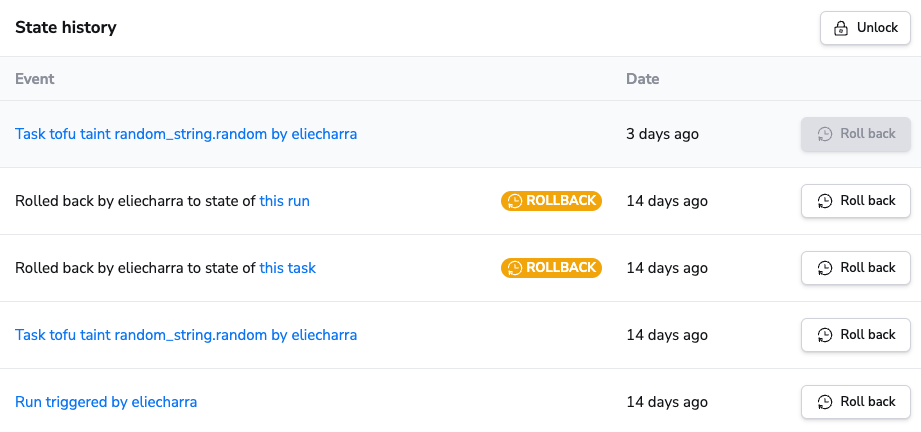
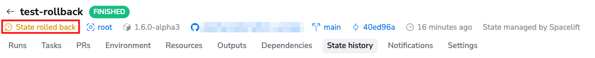
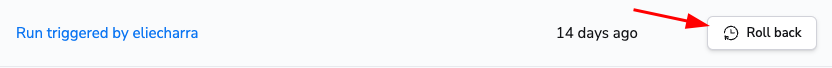
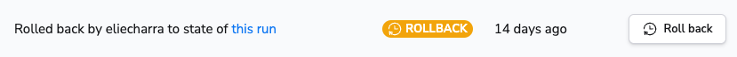
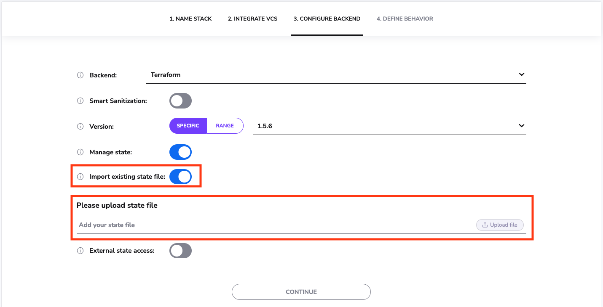
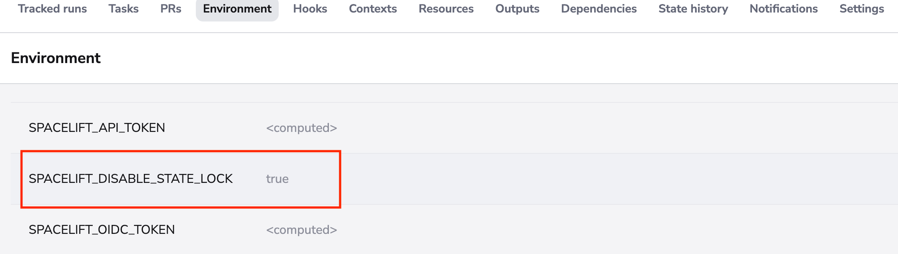

# State management

For those of you who don't want to manage Terraform state, Spacelift offers an optional sophisticated state backend
synchronized with the rest of the application to maximize security and convenience. The ability to have Spacelift manage
the state for you is only available during [stack creation](../../concepts/stack/creating-a-stack.md#terraform).

As you can see, it's also possible to import an existing Terraform state at this point, which is useful for users who
want to upgrade their previous Terraform workflow.

!!! info

    If you're using Spacelift to manage your stack, do not specify any [Terraform backend](https://www.terraform.io/docs/backends/index.html){: rel="nofollow"} whatsoever. The one-off config will be dynamically injected into every [run](../../concepts/run/README.md) and [task](../../concepts/run/task.md).

## Do. Or do not. There is no try.

In this section we'd like to give you a few reasons why it could be useful to trust Spacelift to take care of your
Terraform state. To keep things level, we'll also give you a reason not to.

### Do

1. It's **super simple** - just two clicks during stack setup. Otherwise there's nothing to set up on your end, so one
   fewer sensitive thing to worry about. Feel free to refer
   to [how it works on our end](state-management.md#how-it-works), but overall we believe it to be a rather sensible and
   secure setup, at least on par with anything you could set up on your end.

2. It's **protected against accidental or malicious access**. Again, you can refer to the more technical section on the
   inner workings of the state server, but the gist is that we're able to map state access and state changes to
   legitimate Spacelift runs, thus automatically blocking all other unauthorized traffic. As far as we know, no other
   backend is capable of that, which is one more reason to give us a go.

### Don't

1. We'll let you in on a little secret now - behind the pixie dust it's still Amazon S3 all the way down, and at this
   stage [we store all our data in Ireland](../../product/security.md). If you're not OK with that, you're better off
   managing the state on your end.

## How it works

S3, like half of the Internet. The pixie dust we're adding on top of it involves generating one-off credentials for
every [run](../../concepts/run/README.md) and [task](../../concepts/run/task.md) and injecting them directly into the
root of your Terraform project as a `.tf` file.

!!! warning

    If you have some Terraform state backend already specified in your code, the initialization phase will keep failing until you remove it.

The state server is an HTTP endpoint implementing the
Terraform [standard state management protocol](https://www.terraform.io/docs/backends/types/http.html){: rel="
nofollow"}. Our backend always ensures that the credentials belong to one of the runs or tasks that are currently marked
as active on our end, and their state indicates that they should be accessing or modifying the state. Once this is
established, we just pass the request to S3 with the right parameters.

## State history


If your state is managed by spacelift, you can list all the changes on your state, and eventually rollback to an old
version if needed.



!!! info
Not all runs or tasks will trigger a new state version, so you should not expect to see an exhaustive list of your runs
and tasks in this list.
For example runs that produce no Terraform changes do not result in a new state version being created.

Non-current state versions are kept for **30 days**.

### State rollback

In certain unusual scenarios you can end up with a broken or corrupted state being created. This could happen for
example if there was a bug during a Terraform provider upgrade.

State rollback allows you to recover from this by rolling back your state to a previous version.

Rolling back your state will **not apply any changes to your current infrastructure**. It just reverts your state to an
older version.
It's up to you to trigger the proper tasks or runs to fix the state and re-apply the desired Terraform configuration.

!!! warning
You should really understand what you are doing when performing a rollback.

    State rollback should be used as a break-glass operation just after a corrupted state has been created.

If a stack is currently using a rolled-back state, a warning will be shown in the stack header.



To be able to roll back a state, the 3 conditions below must be satisfied:

- You must be a stack admin
- The stack must be locked
- The stack must not have any pending runs or tasks

If those three conditions are met, you will be able to rollback your stack to a previous version of your state file.



After rollback completes successfully, a new version of your state will appear above the other state versions and will be marked as a rollback.



## Importing resources into your Terraform State

So you have an existing resource that was created by other means and would like that resource to be reflected in your
terraform state. This is an excellent use case for the [terraform import](https://www.terraform.io/cli/import){: rel="
nofollow"} command. When you're managing your own terraform state, you would typically run this command locally to
import said resource(s) to your state file, but what do I do when I'm using Spacelift-managed state you might ask?
Spacelift [Task](../../concepts/run/task.md) to the rescue!

To do this, use the following steps:

- Select the Spacelift Stack to which you would like to import state for.
- Within the navigation, select "Tasks"


- Run the `terraform import` command needed to import your state file to the Spacelift-managed state by typing the
  command into the text input and clicking the perform button. Note: If you are using Terragrunt on Spacelift, you will
  need to run `terragrunt import`


- Follow the status of your task's execution to ensure it was executed successfully. When completed, you should see an
  output similar to the following within the "Performing" step of your task.


## Importing existing state file into your Terraform Stacks

When creating a stack, you can optionally import an existing Terraform state file so that Spacelift can manage it going
forward.



You can also import an existing Terraform state file when using Spacelift Terraform provider.

```terraform title="stack.tf"
resource "spacelift_stack" "example-stack" {
  name = "Example Stack in Spacelift"

  # Source code.
  repository = "<Repository Name>"
  branch = "main"

  # State file information
  import_state      = "<State File to Upload>"
  import_state_file = "<Path to the State file>"
}
```

## Exporting Spacelift-managed Terraform state file

!!! info

    If you enable [external state access](external-state-access.md), you can export the stack's state from outside of Spacelift.

If a Terraform stack's state is managed by Spacelift and you need to export it you can do so by running the following
command in a [Task](../../concepts/run/task.md#performing-a-task):

```shell
terraform state pull > terraform.tfstate
```

The local workspace is discarded after the Task has finished so you most likely want to combine this command with
another one that pushes the `terraform.tfstate` file to some remote location.

Here is an example of pushing the state file to an AWS S3 bucket (without using an intermediary file):

```shell
terraform state pull | aws s3 cp - s3://example-bucket/folder/sub-folder/terraform.tfstate
```

### Configure terraform plan locking

By default `terraform plan` acquires a state lock. If you want to disable such lock during planning,
you can pass `SPACELIFT_DISABLE_STATE_LOCK` to the stack _Environment_.


!!! warning

    You should really understand what you are doing when disabling state lock for planning.
    Disabling the lock may lead to incorrect results in case of concurrent apply operation to the state.
