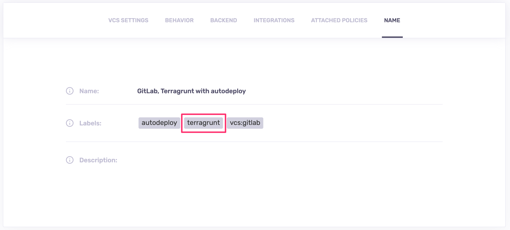
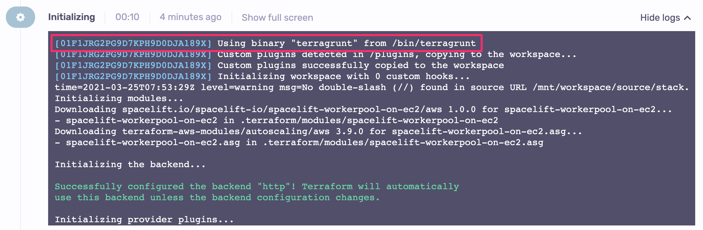

# Terragrunt

## Using Terragrunt

Whether a Terraform stack is using Terragrunt or not is controlled by the presence of `terragrunt` label on the stack:

If present, all workloads will use `terragrunt` instead of `terraform` as the main command. Since Terragrunt API is a superset of Terraform's, this is completely transparent to the end user.

Terragrunt is installed on our [standard runner image](../../integrations/docker.md#standard-runner-image). ). This functionality was designed to operate in a very different mode and environment and is strictly outside our scope.If you're not using our runner image, you can [install Terragrunt separately](https://terragrunt.gruntwork.io/docs/getting-started/install/#install-terragrunt){: rel="nofollow"}.

During the _Initialization_ phase we're showing you the exact binary that will process your job, along with its location:

## Versioning with Terragrunt

When working with Terragrunt, you will still specify the Terraform version to be used to process your job. We don't do it for Terragrunt, which is [way more relaxed in terms](https://terragrunt.gruntwork.io/docs/getting-started/supported-terraform-versions/){: rel="nofollow"} of how it interacts with Terraform versions, especially since we're only using a very stable subset of its API.

On our runner image, we install a version of Terragrunt that will work with the latest version of Terraform that we support. If you need a specific version of Terragrunt, feel free to create a custom runner image and install the Terragrunt version of your choosing.

## Scope of support

We're currently using Terragrunt the same way we're using Terraform, running `init`, `plan`, and `apply` commands. This means we're not supporting [executing Terraform commands on multiple modules at once](https://terragrunt.gruntwork.io/docs/features/execute-terraform-commands-on-multiple-modules-at-once/){: rel="nofollow"} (`run-all`). This functionality was designed to operate in a very different mode and environment, and is strictly outside our scope.
