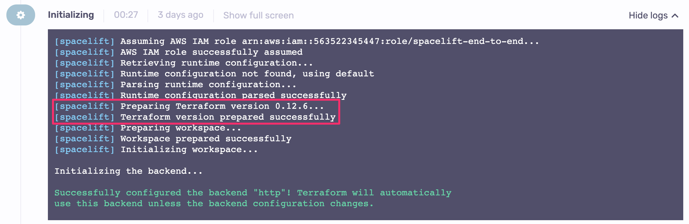
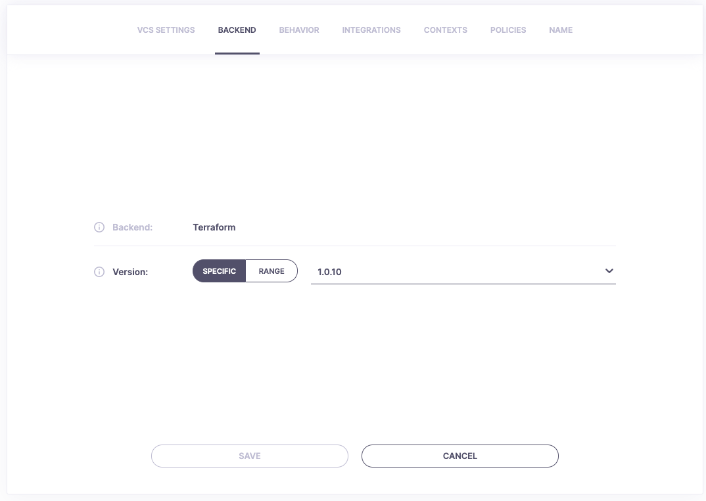

# Version management

## Intro to Terraform versioning

Terraform is an [actively developed](https://github.com/hashicorp/terraform/pulse){: rel="nofollow"} open-source product with a [mighty sponsor](https://www.hashicorp.com){: rel="nofollow"}. This means frequent releases - in fact, over the last few months (since minor version `0.12`) we've been seeing [nearly weekly releases](https://github.com/hashicorp/terraform/releases){: rel="nofollow"}. While that's all great news for us as Terraform users, we need to be aware of how version management works in order not to be caught off-guard.

Historically (until 0.15.x), once the state was written to (applied) with a higher version of Terraform, there was no way back. Hence, you had to be very careful when updating your current Terraform versions. If you're still using an older version of Terraform with Spacelift, you will likely want to use the [runtime configuration](../../concepts/configuration/runtime-configuration/#terraform_version-setting) to preview the intended changes before you make the jump.

Currently (since version 0.15.x) the state format is stable so this is no longer a problem and you don't need to be that extra careful with Terraform versions.

## Terraform versions in Spacelift

Terraform binaries are neither distributed with Spacelift nor with its [runner Docker image](../../integrations/docker.md). Instead, Spacelift **dynamically detects** the right version for each workflow ([run](../../concepts/run/) or [task](../../concepts/run/task.md)), downloads the right binary on demand, verifies it, and mounts it as read-only on the runner Docker container as `/bin/terraform` to be directly available in the runner's `$PATH`:

There are two ways to tell Spacelift which Terraform version to use. The main one is to set the version directly on the stack. The version can be set in the Backend section of the stack configuration:

Note that you can either point to a specific version or define a version range, which is particularly useful if you don't want to update your code every time the Terraform version changes. The exact supported syntax options can be found [here](https://github.com/blang/semver#ranges){: rel="nofollow"}.

The other way of specifying the Terraform version is to set it [through runtime configuration](../../concepts/configuration/runtime-configuration/). The runtime configuration is useful if you want to validate your Terraform code with a newer version of the binary before committing to it - which is especially important in older versions where the state format was not yet stable.

If you're creating stacks programmatically but intend to make independent changes to the Terraform version (eg. using runtime configuration), we advise you to [ignore any subsequent changes](https://www.terraform.io/docs/configuration/resources.html#ignore_changes){: rel="nofollow"}.

In order to determine the version of the Terraform binary to mount, Spacelift will first look at the [runtime configuration](../../concepts/configuration/runtime-configuration/#terraform_version-setting). If it does not contain the version setting for the current stack, the stack setting is then considered. If there is no version set on the current stack, the **newest supported Terraform version** is used. We always advise creating stacks with the newest available version of Terraform, though we realize it may not be the best option if the project is imported from elsewhere or incompatible providers are used.

!!! warning
    The newest Terraform version supported by Spacelift may lag a bit behind the latest available Terraform release. We err on the side of caution and thus separately verify each version to ensure that it works as expected and that our code is compatible with its output and general behavior. We're trying to catch up roughly within a week but **may temporarily blacklist a faulty version**. If you need a compatibility check and a bump sooner than that, please [file a ticket](https://forms.gle/eFEcsLr5gaiWxSE5A){: rel="nofollow"}.

Once we apply a run with a particular version of Terraform, we set it on the stack to make sure that we don't implicitly attempt to update it using a lower version.

## Migrating to newer versions

In order to migrate a [stack](../../concepts/stack/) to a newer version of Terraform, we suggest opening a feature branch bumping the version through [runtime configuration](../../concepts/configuration/runtime-configuration/#terraform_version-setting). Open a Pull Request in GitHub from the feature branch to the tracked branch to easily get a link to your proposed run and see if everything looks good. If it does, merge your Pull Request and enjoy working with the latest and greatest version of Terraform. Otherwise, try making necessary changes until your code is working or postpone the migration until you have the bandwidth to do so.

!!! info
    In general, we suggest to try and keep up with the latest Terraform releases. **The longer you wait, the more serious is the migration work going to be**. Terraform evolves, providers evolve, external APIs evolve and so should your code.
