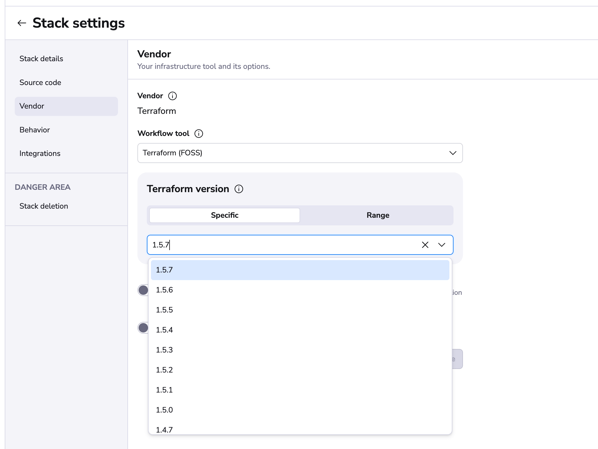

# Version management

## Intro to OpenTofu/Terraform versioning

In 2023, the Terraform ecosystem underwent significant changes. HashiCorp changed Terraform's license from Mozilla Public License v2.0 (MPL 2.0) to the Business Source License (BSL) 1.1, which led to the creation of OpenTofu - a community-led, open-source fork maintained by the Linux Foundation that preserves the MPL 2.0 license.

Both Terraform and OpenTofu remain [actively developed](https://github.com/opentofu/opentofu/pulse){: rel="nofollow"} with frequent releases. OpenTofu is designed as a drop-in replacement for Terraform, maintaining compatibility with existing Terraform configurations, providers, and modules.

Since version 0.15.x, the state format has been stable, meaning you don't need to be as cautious with version updates as in earlier releases (pre-0.15.x) where once the state was written with a higher version, there was no way back.

## OpenTofu/Terraform versions in Spacelift

Neither OpenTofu nor Terraform binaries are distributed with Spacelift or its [runner Docker image](../../integrations/docker.md). Instead, Spacelift **dynamically detects** the right version for each workflow ([run](../../concepts/run/README.md) or [task](../../concepts/run/task.md)), downloads the appropriate binary on demand, verifies it, and mounts it as read-only on the runner Docker container as `/bin/terraform` or `/bin/tofu` to be directly available in the runner's `$PATH`:

!!! info
    Spacelift will not download versions of Terraform released under the Business Source License (BSL). Only versions released under the Mozilla Public License v2.0 (MPL 2.0) before the license change are available, along with all versions of OpenTofu.

There are two ways to tell Spacelift which OpenTofu/Terraform version to use. The main one is to set the version directly on the stack. The version can be set in the Vendor section of the stack configuration:

Note that you can either point to a specific version or define a version range, which is particularly useful if you don't want to update your code every time the OpenTofu/Terraform version changes. The exact supported syntax options can be found [here](https://github.com/blang/semver#ranges){: rel="nofollow"}.

The other way of specifying the OpenTofu/Terraform version is to set it [through runtime configuration](../../concepts/configuration/runtime-configuration/README.md). The runtime configuration is useful if you want to validate your code with a newer version of the binary before committing to it.

If you're creating stacks programmatically but intend to make independent changes to the OpenTofu/Terraform version (eg. using runtime configuration), we advise you to [ignore any subsequent changes](https://www.terraform.io/docs/configuration/resources.html#ignore_changes){: rel="nofollow"}.

In order to determine the version of the binary to mount, Spacelift will first look at the [runtime configuration](../../concepts/configuration/runtime-configuration/README.md#terraform_version-setting). If it does not contain the version setting for the current stack, the stack setting is then considered. If there is no version set on the current stack, the **newest supported version** is used. We always advise creating stacks with the newest available version, though we realize it may not be the best option if the project is imported from elsewhere or incompatible providers are used.

!!! warning
    The newest OpenTofu/Terraform version supported by Spacelift may lag a bit behind the latest available release. We err on the side of caution and thus separately verify each version to ensure that it works as expected and that our code is compatible with its output and general behavior. We're trying to catch up roughly within a week but **may temporarily blacklist a faulty version**. If you need a compatibility check and a bump sooner than that, please get in touch with our support.

Once we apply a run with a particular version of OpenTofu/Terraform, we set it on the stack to make sure that we don't implicitly attempt to update it using a lower version.

## Migrating to newer versions or between OpenTofu and Terraform

In order to migrate a [stack](../../concepts/stack/README.md) to a newer version, we suggest opening a feature branch bumping the version through [runtime configuration](../../concepts/configuration/runtime-configuration/README.md#terraform_version-setting). Open a Pull Request in GitHub from the feature branch to the tracked branch to easily get a link to your proposed run and see if everything looks good. If it does, merge your Pull Request and enjoy working with the latest and greatest version.

If you're considering migrating between OpenTofu and Terraform, keep in mind that OpenTofu is designed to be a drop-in replacement for Terraform. State files are compatible between the two tools, though you'll need to update your commands (e.g., using `tofu` instead of `terraform`) and possibly your CI/CD pipelines.

!!! info
    In general, we suggest trying to keep up with the latest releases. **The longer you wait, the more serious the migration work is going to be**. As the infrastructure-as-code ecosystem evolves, providers evolve, external APIs evolve, and so should your code.
