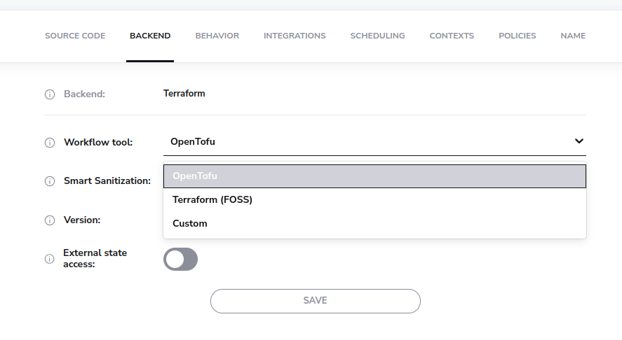
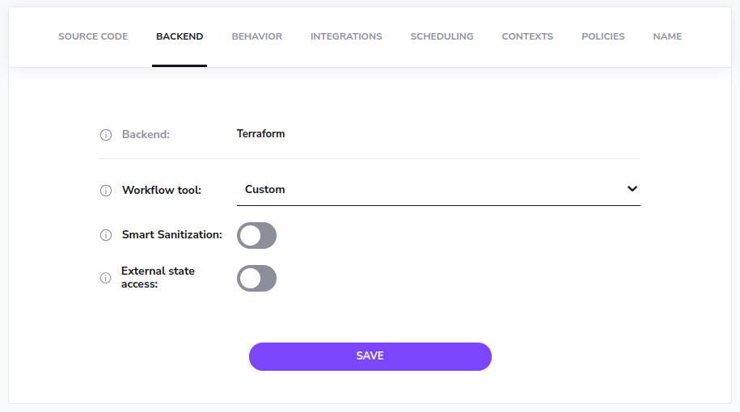
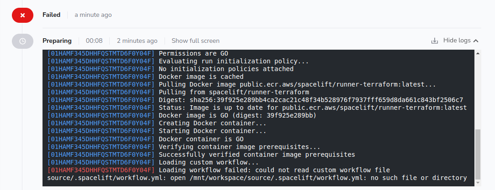
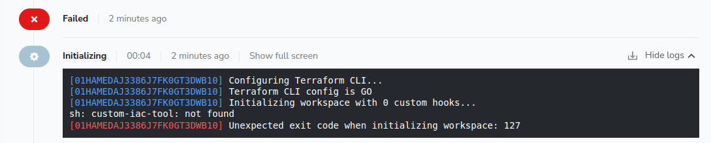

# Workflow Tool

The Workflow Tool stack setting allows you to choose between three options:

- OpenTofu.
- Terraform (FOSS).
- Custom.

The OpenTofu and Terraform (FOSS) options give you out the box support for using OpenTofu and for open source versions of Terraform respectively. When you use either of those options, all you need to do is choose the version you want to use and you're good to go.

The rest of this page explains the Custom option. This option allows you to customize the commands that are executed as part of Spacelift's Terraform workflow. This can be useful if you want to run a custom binary instead of one of the OpenTofu or Terraform versions supported out the box by Spacelift.

## How does it work?

Each stage of the Terraform workflow uses certain commands to perform tasks such as generating a Terraform plan, or getting the current state. We provide a built-in set of commands to use for Terraform, but you can also specify your own custom commands. You do this via a file called `.spacelift/workflow.yml`.

The following is an example of what the workflow commands look like for Terraform:



```yaml
# Used to initialize your root module.
init: terraform init -input=false

# Used to select the correct workspace. Only used for Stacks that are using a custom state
# backend, and which have the Workspace setting configured.
#
# Available template parameters:
# - .WorkspaceName - contains the name of the workspace to select.
workspaceSelect: terraform workspace select "{{ .WorkspaceName }}"

# Used to create a new workspace if none with the required name exists. Only used for Stacks
# that are using a custom state backend, and which have the Workspace setting configured.
#
# Available template parameters:
# - .WorkspaceName - contains the name of the workspace to select.
workspaceNew: terraform workspace new "{{ .WorkspaceName }}"

# Used to generate a plan of the infrastructure changes that will be applied.
#
# Available template parameters:
# - .Lock         - whether the state should be locked.
# - .Refresh      - whether state resources should be refreshed.
# - .PlanFileName - the name of the file to store the plan in.
# - .Targets      - the list of targets to plan. Used during targeted replans.
plan: terraform plan -input=false -lock={{ .Lock }} {{ if not .Refresh }}-refresh=false {{ end }}-out={{ .PlanFileName }} {{ range .Targets }}-target='{{ . }}' {{ end }}

# Outputs the current state information as JSON.
showState: terraform show -json

# Used to convert a plan file to its JSON representation.
#
# Available template parameters:
# - .PlanFileName - the name of the file containing the plan.
showPlan: terraform show -json "{{ .PlanFileName }}"

# Used to get the current outputs from the state.
getOutputs: terraform output -json

# Used to apply any changes contained in the specified plan.
#
# Available template parameters:
# - .PlanFileName - the name of the file containing the plan.
apply: terraform apply -auto-approve -input=false "{{ .PlanFileName }}"

# Used to tear down any resources as part of deleting a stack.
destroy: terraform destroy -auto-approve -input=false
```



## How to configure a custom tool

To use a custom tool, three things are required:

1. A way of providing the tool to your runs.
2. A way of specifying the commands that should be executed.
3. Indicating that you want to use a custom tool on your stack/module.

### Providing a tool

There are two main ways of providing a custom tool:

- Using a [custom runner image](../../integrations/docker.md#customizing-the-runner-image).
- Using a [before_init hook](../../concepts/stack/stack-settings.md#customizing-workflow) to download your custom tool.

### Specifying the commands

Your custom workflow commands need to be provided in a `workflow.yml` file stored in the `.spacelift` folder at the root of your workspace. There are three main ways of providing this:

1. Via a mounted file in the stack's environment.
2. Via a mounted file stored in a [context](../../concepts/configuration/context.md)
3. Directly via your Git repo.

The option you choose will depend on your exact use-case, for example using the stack's environment allows you to quickly test out a new custom tool, using a context allows you to easily share the same configuration across multiple stacks, and storing the configuration in your Git repo allows you to track your settings along with the rest of your code.

Here is an example configuration to use a fictional tool called `super-iac`:



```yaml
init: super-iac init -input=false
workspaceSelect: super-iac workspace select "{{ .WorkspaceName }}"
workspaceNew: super-iac workspace new "{{ .WorkspaceName }}"
plan: super-iac plan -input=false -lock={{ .Lock }} {{ if not .Refresh }}-refresh=false {{ end }}-out={{ .PlanFileName }} {{ range .Targets }}-target='{{ . }}' {{ end }}
showState: super-iac show -json
showPlan: super-iac show -json "{{ .PlanFileName }}"
getOutputs: super-iac output -json
apply: super-iac apply -auto-approve -input=false "{{ .PlanFileName }}"
destroy: super-iac destroy -auto-approve -input=false
```



### Using a custom tool on a Stack/Module

To update your Stack/Module to use a custom workflow tool, edit the _Workflow tool_ setting in the _Backend_ settings:



When you choose the _Custom_ option, the version selector will disappear:



This is because you are responsible for ensuring that the tool is available to the Run, and Spacelift will not automatically download the tool for you.

#### Runtime Configuration

You can also use [runtime configuration](../../concepts/configuration/runtime-configuration/README.md) to configure the workflow tool for a stack or module. This allows you to try out a different configuration as part of a PR without adjusting your stack/module settings.

The following example shows how to configure a particular stack to use a custom tool:

```yaml
version: "1"

stacks:
  custom-workflow-stack:
    terraform_workflow_tool: "CUSTOM"
```

The following example shows how to do the same for a module test case:

```yaml
version: 1
module_version: 0.0.1

tests:
  - name: Create a pet
    project_root: examples/create-a-pet
    terraform_workflow_tool: "CUSTOM"
```

## Troubleshooting

### Workflow file not found

If no workflow.yml file has been created but your Stack has been configured to use a custom tool, you may get an error message like the following:



If this happens, please ensure you have added a `.spacelift/workflow.yml` file to your Git repository, or attached it to your Stack's environment via a mounted file.

### Commands missing

If your `.spacelift/workflow.yml` does not contain all the required command definitions, or if any commands are empty, you will get an error message like the following:


This check is designed as a protection mechanism in case new commands are added but your workflow hasn't been updated. In this case, please provide an implementation for the specified commands (in the example the `init` and `workspaceSelect` commands),

### Tool not found

If your custom tool binary cannot be found you will get an error message like the following:



In this situation, please ensure that you are [providing a custom workflow tool](#providing-a-tool) via a custom runner image or workflow hook.
