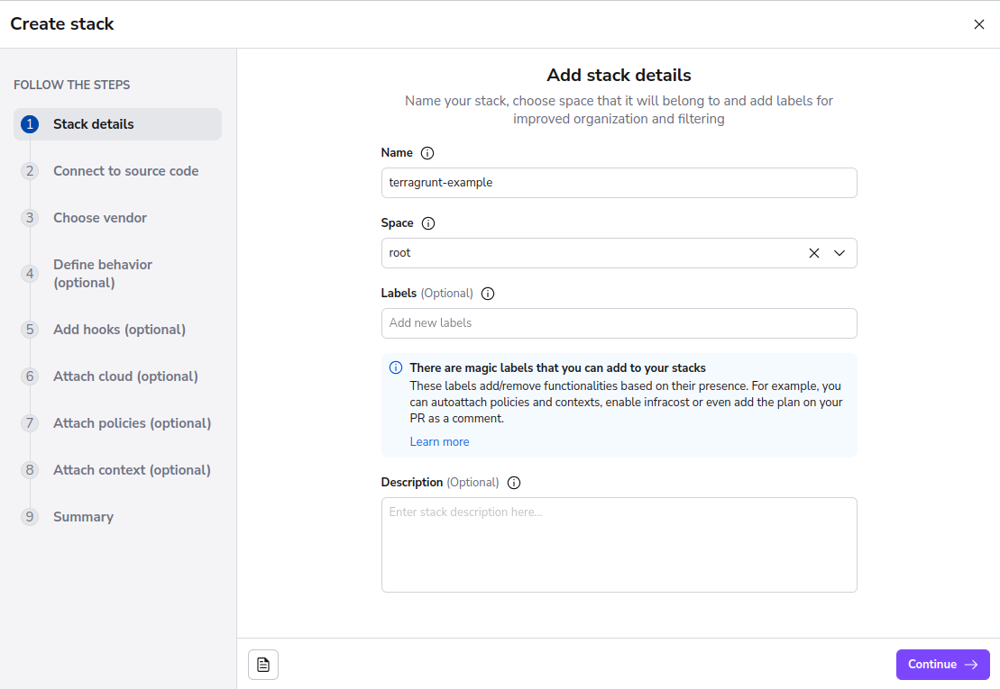
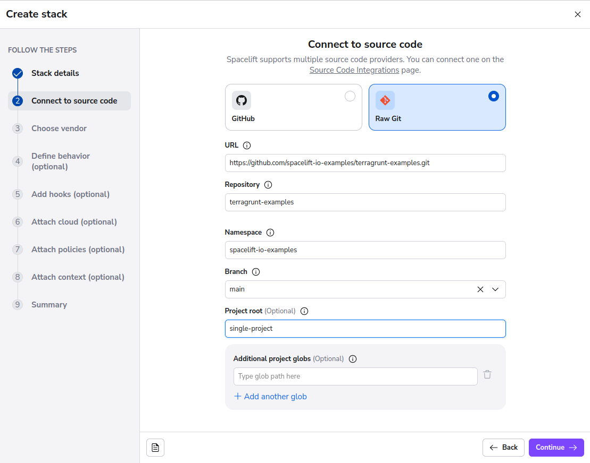
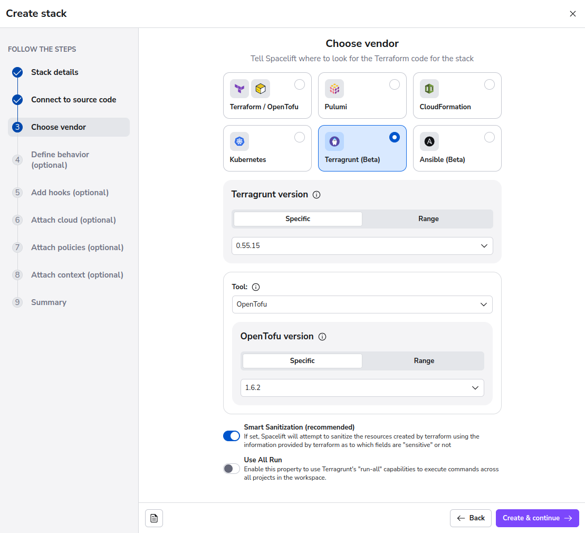
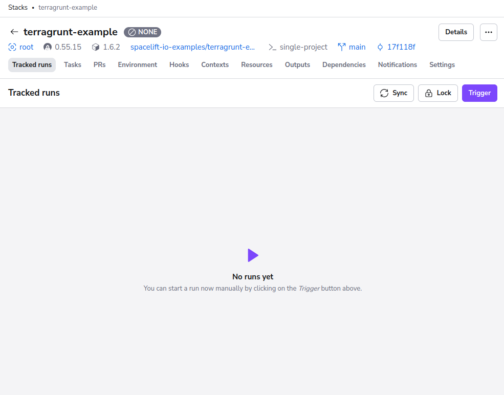

# Getting Started

!!! warning
    Terragrunt support is currently in **beta** and has some important limitations to take into consideration. Please see our documentation [here](limitations.md) for more information.

This documentation will be using an example repository Spacelift provides [here](https://github.com/spacelift-io-examples/terragrunt-examples). This repository contains 2 different examples, but for getting started we will be using the single-stack example.

## Creating a new stack

In Spacelift, go ahead and click the **Add Stack** button to create a new Stack.

### Naming the stack

Once in the stack creation wizard, Give your stack a name such as **terragrunt-example** then press **Continue** to configure our VCS settings for the stack.

### Linking to the Terragrunt code

On this VCS configuration screen, Select **Raw Git** as your Provider, and provide the following URL: **<https://github.com/spacelift-io-examples/terragrunt-examples.git>** and a Project Root of **single-project**.

Pressing next on this page will take you through to the backend configuration page.

This page has quite a few options but the ones that we will be using for this example are as follows:

Press **Continue** to finish the backend configuration and move through to defining stack behavior. For this example nothing needs to be edited here so be sure to hit **Save Stack** to complete the process.

## Deploying the stack

Spacelift will take you to the Runs view for the Stack you've just created. Once on this page, press the **Trigger** button to trigger a new Run.

You should now be taken through the process of deploying your stack. This takes you through multiple stages of a run, moving through initialization, planning and ending up in an **unconfirmed** state.

### Examining the planned changes

In this unconfirmed state we have time to review what is going to change if we were to continue and confirm and apply.  By pressing the `changes +2` button at the top of the page, we are taken to an overview of the planned changes.

For this stack we should see that 2 resources are being created and we can see what values these resources and outputs are expected to have. This is a very useful view to see at a glance, what is going to happen in as a result of your deployment.

### Confirming and applying the changes

!!! info
    Due to security reasons and limitations of Terragrunt and its mocked outputs, Spacelift does not use the planfile in the applying as there is a possibility to deploy mock values.

Once you're happy with the changes, press the **Confirm** button to allow the run to continue and begin the applying phase of the run.

## Conclusion

You have now successfully deployed a Terragrunt stack using Spacelift! Congratulations.

For further reading, we recommend looking into using the `Run all` setting to enable you to deploy multiple projects using `terragrunt run-all` by reading our documentation [here](run-all.md). We also recommend that if you are looking into using Terragrunt with Spacelift that you read our page on the [Limitations of Terragrunt](limitations.md).
