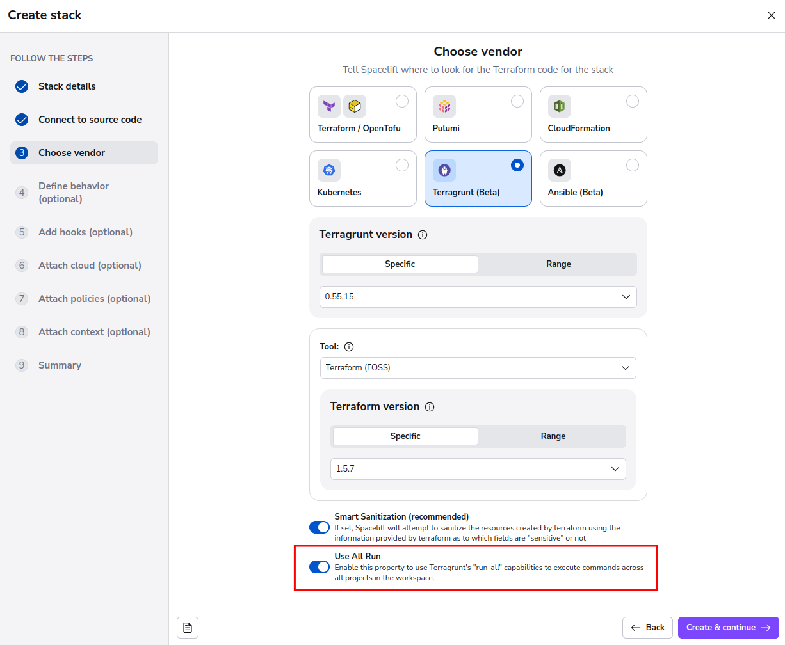
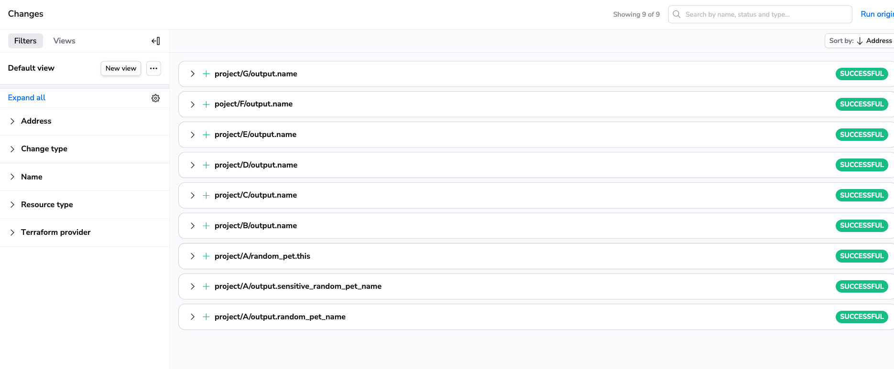

# Using Run-All

## Introduction

Terragrunt's [run-all](https://terragrunt.gruntwork.io/docs/features/execute-terraform-commands-on-multiple-modules-at-once/){: rel="nofollow"} feature allows you to deploy multiple modules at the same time. This very powerful feature allows you to develop large amounts of infrastructure as code with dependencies, mocked values, and while keeping things [DRY](https://terragrunt.gruntwork.io/docs/features/keep-your-terraform-code-dry/){: rel="nofollow"}.

## How to use run-all

When creating a stack in Spacelift, you can enable the **Use Run All** property to start using this functionality natively in your own stacks:

When this option is enabled, Spacelift will run all Terragrunt commands with the `run-all` option, taking into account any dependencies between your projects!

## Why are my resources named strangely?

Due to the way Terragrunt works, you may find that modules and projects create outputs or resources with the same names, and we want to make sure that you can determine the origin of all of your resources without getting confused about "Which project created `output.password`"?

For this reason, we prepend the addresses of your outputs and resources in the Spacelift user interface with the project they originated from. This allows you to keep on top of your resources, understand at a glance how things were created, and identify issues faster, Giving you more control and visibility over the resources you create!
