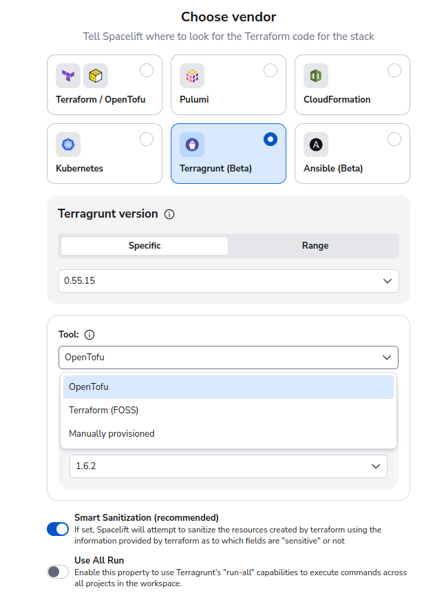
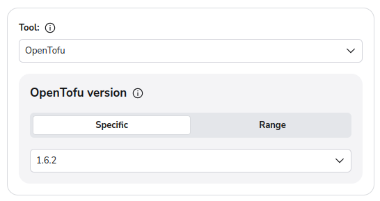

# Terragrunt Tool

Spacelift provides the ability to choose the tool that should be used by Terragrunt to provision your infrastructure. Three options are supported:

- OpenTofu
- Terraform
- Manually Provisioned

You can choose which tool you want to use when creating a stack, or via the **Backend** configuration for an existing stack:

If you choose either OpenTofu or Terraform, you can then also choose the version that you want to use:

When you do this, Spacelift will automatically download the specified version of your tool when preparing your runs, and will set the `TERRAGRUNT_TFPATH` to point at the correct tool.

## Manually Provisioning

If you want to use a different tool other than OpenTofu, or one of the versions of Terraform supported by Spacelift, you can choose the **Manually provisioned** option. When you choose this option, you are responsible for two things:

1. Making sure that the tool is available for Terragrunt to use. You can use either a [before init hook](../../concepts/stack/stack-settings.md#customizing-workflow) for this, or you can create a [custom runner image](../../integrations/docker.md#customizing-the-runner-image) for your stack that has your tool available.
2. Specifying the path to your tool. You can do this via the [terraform_binary Terragrunt option](https://terragrunt.gruntwork.io/docs/reference/config-blocks-and-attributes/#terraform_binary), for example by setting the `TERRAGRUNT_TFPATH` environment variable.

## Overriding the `TERRAGRUNT_TFPATH` variable

If you are already setting the `TERRAGRUNT_TFPATH` variable on your stack, your existing value will have precedence over the automatically configured value and will continue to be used. This means that if you had customized the path to the Terragrunt tool before the functionality was added natively to Spacelift, your existing stacks will continue to work.

If you are currently using this approach to use OpenTofu with Terragrunt, and want to switch to the native approach, please make sure to remove your environment variable override so that it doesn't conflict with the built-in Spacelift functionality.
