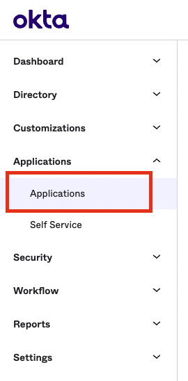
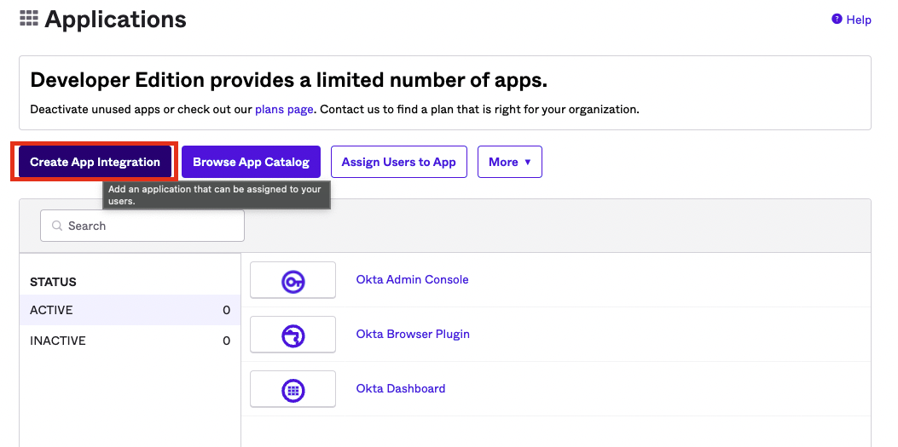
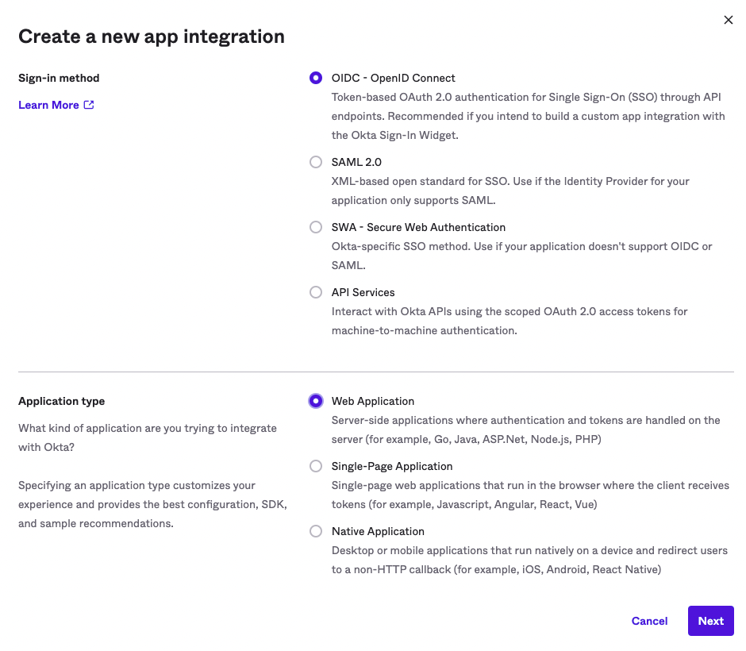
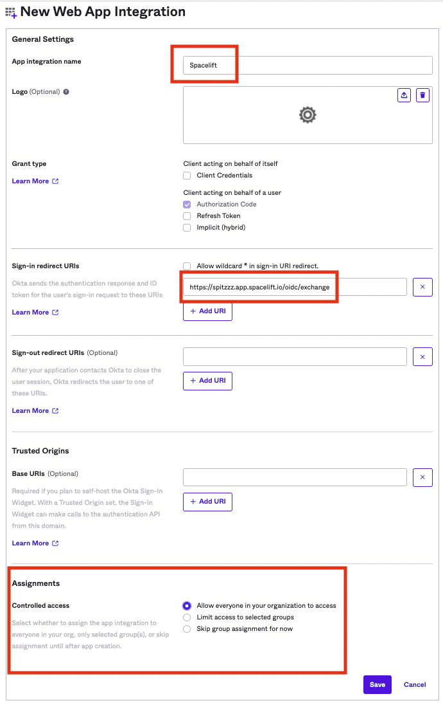
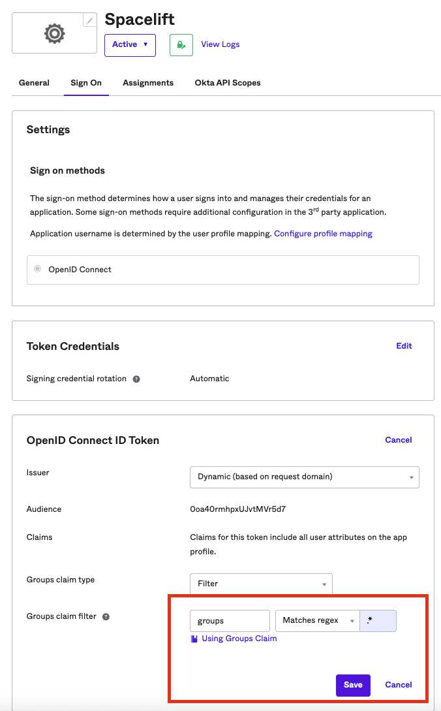
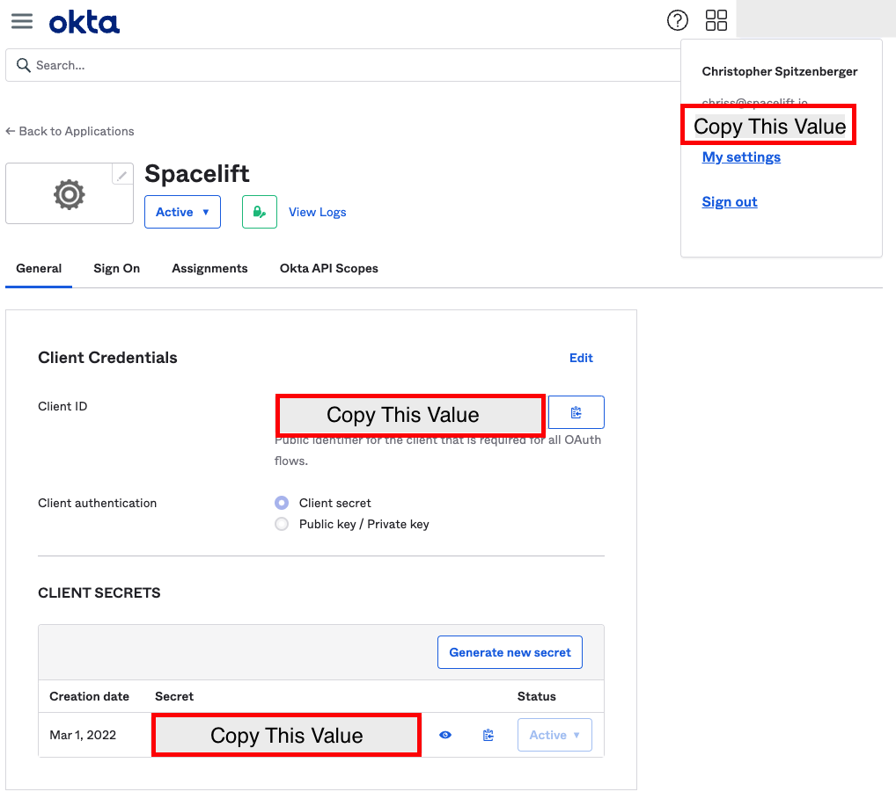
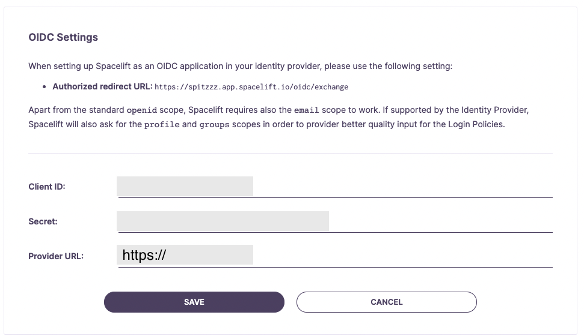

# Okta OIDC Setup Guide

If you'd like to set up the ability to sign in to your Spacelift account using an OIDC integration with Okta, you've come to the right place. This example will walk you through the steps to get this setup, and you'll have Single Sign-On running in no time!

!!! warning
    Before setting up SSO, it's recommended to create backup credentials for your Spacelift account for use in case of SSO misconfiguration, or for other break-glass procedures. You can find more about this in the [Backup Credentials](./backup-credentials.md) section.

## Pre-requisites

- Spacelift account, with access to admin permissions
- Okta account, with permission to create Okta App Integrations

!!! info
    Please note you'll need to be an admin on the Spacelift account to access the account settings to configure Single Sign-On.

## Configure Account Settings

You'll need to visit the Spacelift account settings page to set up this integration, from the navigation side bar menu, select "Settings."

.png)

## Setup OIDC

Next, you'll want to click the Set Up box underneath the "OIDC Settings" section. This will expand some configuration we will need to fill out in a few minutes, which we will be obtaining from Okta. For now **copy the authorized redirect URL** as we will need to provide Okta this URL when configuring our Okta App Integration.

.png)

## Okta: Select Applications

In a new browser tab, open your Okta account. Select the Applications link from the navigation.

## Okta: Create App Integration

Click the "Create App Integration" button. For the sign in type, ensure you select **OIDC** - for the application type, select **Web Application.**

## Okta: Configure App Integration

Give your app integration a name - Spacelift sounds like a good one.

Remember the **authorized redirect URL** we copied earlier from Spacelift? We'll need that in this step. You'll want to paste that URL into the **Sign-in redirect URIs** input as shown.

As far as the assignments for this app integration, that's up to you at the end of the day. This determines what users from your Okta account will be able to access Spacelift. Click **Save**.

## Okta: Configure Group Claim

Click on the **Sign On** tab within your newly created Okta App Integration,

You'll need to edit the groups claim type to return groups you consider useful in Spacelift Login Policies. For testing purposes, you could set it to **Matches regex** with .\* for the regex value.

## Configure OIDC Settings

Switch back to the **General** tab. Now that we have the Okta App Integration setup, we'll need to take the **Client ID**, **Client Secret**, and **Okta domain**, to configure the Spacelift OIDC Settings.

!!! info
    The Okta Domain will be set as the "Provider URL" in your Spacelift OIDC settings. **Ensure that you prefix this URL with `https://`**.

## Okta OIDC Setup Completed

That's it! Your OIDC integration with Okta should now be fully configured. Feel free to make any changes to your liking within your Okta App Integration configuration for the app that you just created.
