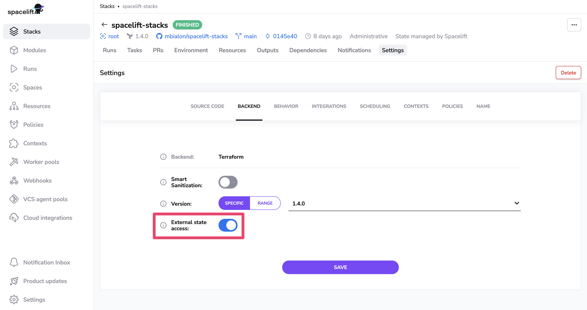

# External state access

External state access allows you to read the state of the stack from outside authorized [runs](../../concepts/run/README.md) and [tasks](../../concepts/run/task.md). In particular, this enables sharing the outputs between stacks using the Terraform mechanism of [remote state](https://www.terraform.io/docs/providers/terraform/d/remote_state.html){: rel="nofollow"} or even accessing the state offline for analytical or compliance purposes.

If enabled for a particular stack, any user or stack with [Write](../../concepts/spaces/access-control.md) permission to that stack's space will be able to access its state.

This feature is off by default.

## Enabling external access

!!! info
    Only administrative stacks or users with write permission to this Stack's space can access the state.

You can enable the external access in a couple of ways.

- through the UI



- using the [Terraform provider](https://registry.terraform.io/providers/spacelift-io/spacelift).

```terraform
resource "spacelift_stack" "example" {
  name                            = "example"
  repository                      = "spacelift-stacks"
  branch                          = "main"
  terraform_external_state_access = true
}
```

## Sharing outputs between stacks

Sharing the outputs between stacks can be achieved using the Terraform mechanism of [remote state](https://www.terraform.io/docs/providers/terraform/d/remote_state.html){: rel="nofollow"}.

Given an account called _spacecorp_, and a stack named _deep-thought_, having the following Terraform configuration.

```terraform
output "answer" {
  value = 42
}
```

You can read that output from a different stack by using the [`terraform_remote_state`](https://www.terraform.io/docs/providers/terraform/d/remote_state.html){: rel="nofollow"} data source.

```terraform
data "terraform_remote_state" "deepthought" {
  backend = "remote"

  config = {
    hostname     = "spacelift.io" # (1)
    organization = "spacecorp"    # (2)

    workspaces = {
      name = "deep-thought"       # (3)
    }
  }
}

output "ultimate_answer" {
  value = data.terraform_remote_state.deepthought.outputs.answer
}
```

1. The hostname of the Spacelift system.
2. The name of the account.
3. The ID of the stack you wish to retrieve outputs from.

## Offline state access

Given an account called `spacecorp`, and a stack named `deep-thought`, having the following Terraform configuration.

```terraform
output "answer" {
  value = 42
}
```

Before you will be able to access the state of the stack, you need to retrieve an authentication token for _spacelift.io_.

```shell
terraform login spacelift.io
```

Next, you need a [remote backend](https://developer.hashicorp.com/terraform/language/settings/backends/remote){: rel="nofollow"} configuration.

```terraform
terraform {
  backend "remote" {
    hostname     = "spacelift.io" # (1)
    organization = "spacecorp"    # (2)

    workspaces {
      name = "deep-thought"       # (3)
    }
  }
}

```

1. The hostname of the Spacelift system.
2. The name of the account.
3. The ID of the stack you wish to retrieve outputs from.

Finally, you can download the state of the stack.

```shell
terraform state pull > terraform.tfstate
```
